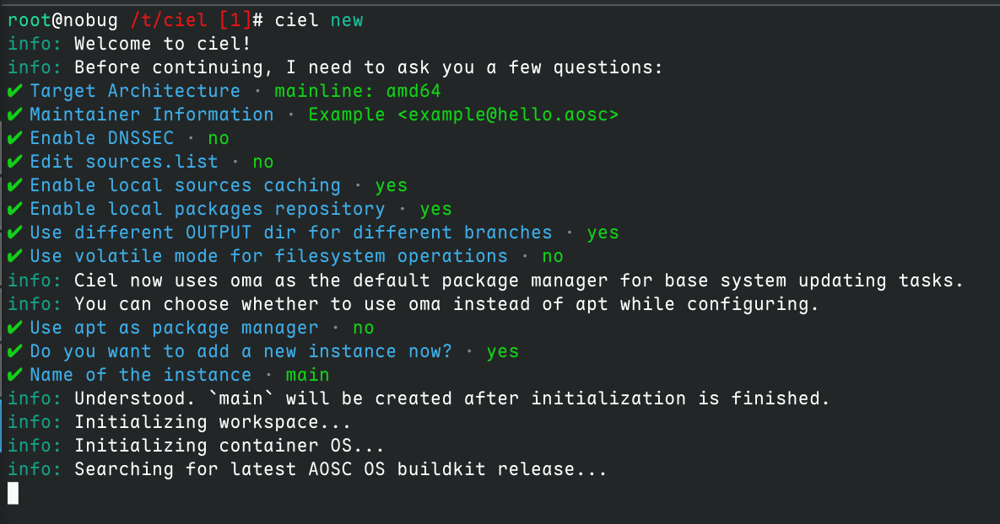
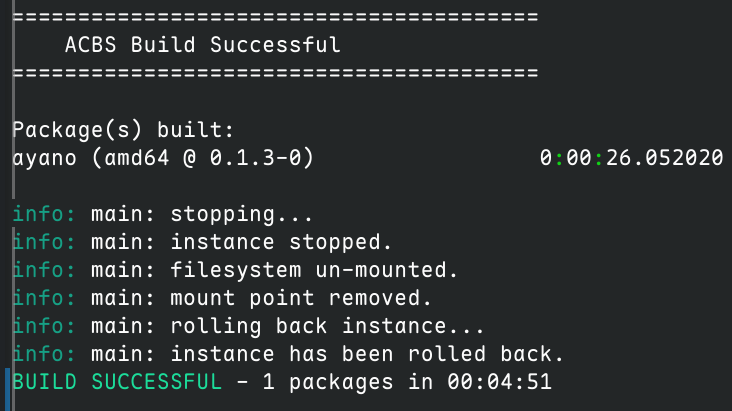

# First PR - 第一次贡献

https://wiki.aosc.io/zh/developer/packaging/basics/

和日后大多数贡献操作不同，在成功提交第一个 PR 之前，您还不是 AOSC 贡献者，也就是说您还需要从自己的 Fork 向主仓库提交 PR。
不过好在其他的操作流程都是相似的，所以入门的第一笔贡献也不会很难。

本文将以我个人的第一次 PR 为例，介绍一下向 AOSC 仓库添加软件包的流程。

https://github.com/AOSC-Dev/aosc-os-abbs/pull/11422

## 仓库介绍

AOSC 目前依赖 Github 作为仓库结构文件的托管平台，所有的包都存放在 `aosc-os-abbs` 仓库中。

https://github.com/AOSC-Dev/aosc-os-abbs

所以我们需要先 Fork 这个仓库到自己的账号下。

## 本地打包环境

我们主要使用 `Ciel` 这一软件作为本地打包工具，如果您在使用 AOSC OS，您可以直接使用 `oma install ciel` 安装 `Ciel`。
我本机使用 Arch Linux, 所以我直接使用 `paru ciel` 就可以安装

然后我们创建一个用来干活的文件夹，平时维护大约需要至少 `10GiB` 的空间。

同时需要强调的是，几乎所有 `ciel` 的命令操作都需要使用 `root` 权限执行，但是如果您先使用 `sudo su` 进入 `root shell` 再进行相关操作时，`~` 通常会指向 `/root`。 而如果只是在每条命令前加上 `sudo`，那么 `~` 就会指向当前用户的家目录。所以如果您使用相对路径进行文件夹操作，记得区分好不同的家目录。

一般来说我推荐先进入 `root shell` 再开始工作，因为 `sudo ciel new` 创建出来的文件夹（尤其是 git 仓库）都是 `root` 权限的，默认用户的 shell（如果使用了相关插件）无法读出当前 git 仓库的状态。

```bash
sudo su
mkdir ~/aosc-dev
cd ~/aosc-dev
```

然后我们就可以使用刚才安装的 `ciel` 工具来创建本地工作区了，需要注意的是创建工作区过程中需要流畅的 Github 访问链接，您可能需要开启某些代理软件的 `TUN` 模式。

```bash
ciel new
```

在初始化过程中会有一个交互式的页面询问您相关的问题，主要涉及的到的有：

* Target Architecture： 一般选择当前工作设备的架构即可，这里我选择 `amd64`
* Maintainer Information： 填写您的贡献者信息，这时您还没有 AOSC 的邮箱，可以写一个自己常用的邮箱
* Do you want to add a new instance now?：这时最后一个问题，我们需要选择 `Yes`，然后创建一个名为 `main` 的实例。


 

然后我们最好更新一下当前的 Buildkit 环境

```bash
# 如果这一步耗时很长，您可以考虑通过 "ciel config -g" 设置 APT 源配置 (sources.list)。
ciel update-os
```

大功告成，这样你就拥有了一套本地的 AOSC 打包环境，可以开始准备进行真正的产出了。

## 初试打包

按照官方文档的推荐，我们可以先打一个 `app-multimedia/flac` 试一下

AOSC 使用一些用途分类的文件夹来管理所有的软件包，但是执行打包的时候只需要输入包自己的名字即可，伟大的 `ciel` 工具会自动帮我们处理好相关的路径问题

```bash
# -i 参数用于指定实例名。
ciel build -i main flac
```

构建成功会提示 `BUILD SUCCESSFUL`, 打出来的包会存放在 `OUTPUT-stable/debs` 文件夹下。

## 添加新包

当我们需要添加一个新软件包时，也就意味着我们需要自己编写关于这个软件包的相关配置文件

首先我们前往工作区的 `TREE` 文件夹，这实际上就是官方的软件包配置仓库，如果你不是 `root shell` 的话可能看不到相关的 git 提示

不同的软件包被分类整理，具体细则可以在 https://github.com/AOSC-Dev/aosc-os-abbs 找到

> * core-* contains components of the AOSC OS Core.
> * app-* contains applications.
> * desktop-* contains desktop environments and their supporting libraries.
> * lang-* contains programming language support stacks.
> * meta-* contains meta packages (*-base).
> * runtime-* contains runtime libraries and data.

为你想要添加的软件包选择一个合适的分类，然后创建软件包名的文件夹，比如我这里要提交的包和网络日志分析相关：

```bash
mkdir app-network/ayano
```

一个软件包通常涉及的到的文件有（以 mihomo 为例）：

```bash
root@nobug /s/c/T/a/mihomo (stable)# tree
.
├── autobuild
│   ├── defines
│   ├── overrides
│   │   └── usr
│   │       └── lib
│   │           └── systemd
│   │               ├── system
│   │               │   ├── clash-meta@.service
│   │               │   └── mihomo.service
│   │               └── user
│   │                   └── clash-meta.service
│   ├── patches
│   │   ├── 0001-FROM-AOSC-disable-updater.patch
│   │   ├── 0002-fix-rule-provider-0day.patch
│   │   └── 0003-fix-extrenal0ui-suid-0day.patch
│   └── prepare
└── spec
```

当然，一般初次提交时不需要涉及这么多文件的编写，我们只需要注意 `spec` 和 `autobuild/defines` 这两个文件即可

### spec 文件

spec 文件提供用于指示 ACBS 下载源码文件的配置，以及软件包版本和修订 (Revision) 级别。该文件内容大致如下：

```toml
VER=4.24  # 软件版本。
# REL=0 软件修订级别。该变量默认赋值为 0。

# 如使用源码压缩包 (tarball) 。
SRCS="tbl::https://i3wm.org/downloads/i3-$VER.tar.xz" # 源码包下载地址。
CHKSUMS="sha256::5baefd0e5e78f1bafb7ac85deea42bcd3cbfe65f1279aa96f7e49661637ac981" # 源码包校验和。

# 如使用 Git 源码。
SRCS="git::commit=$COMMIT_ID::https://some.git.hosting/somewhere"
CHKSUMS="SKIP"

# 如使用多个源码。
SRCS="git::commit=$COMMIT_ID::https://some.git.hosting/somewhere \
      tbl::https://some.domain/source_tarball.tar.gz \
      file::https://some.domain/souce_code_file"
CHKSUMS="SKIP sha256::some_checksum sha256::sume_checksum"
```
在这里尤其需要注意修订级别的值：在引入新软件包或更新现有软件包时，您可以忽略 REL= 变量，但在对进行软件包修订且软件包版本不变时，您需要通过提高某个软件包的修订级别以告知软件包管理器需要更新该软件包。在这种情况下，将 REL= 值加 1 即可。


以我这次提交的 `ayano` 软件包为例

```toml
VER=0.1.3
SRCS="git::commit=tags/v$VER::https://github.com/taoky/ayano.git"
CHKSUMS="SKIP"
CHKUPDATE="anitya::id=378730"
```

该软件包的版本格式形如 `v0.1.3`，如果您要添加的软件包与此不同，您可能需要修改 `SRCS` 链接的格式。对于通过 git 仓库指定源码的情况，`CHKSUMS` 可以设置为 `SKIP`。

#### 自动更新检查器

那最后一行的 `CHKUPDATE` 又是什么呢？这是 AOSC 构建系统检查软件包是否更新的参数，具体信息在：

https://github.com/AOSC-Dev/aosc-findupdate/blob/master/docs/config.zh-CN.md

只要 `anitya` 可用，我们就强烈推荐使用此作为软件包的更新检查方式。`anitya` 是一个开源的更新检查平台，位于 https://release-monitoring.org/ ，您可以先搜索自己想要添加的软件包是否被该平台收录，如果没有的话您可能需要自行注册一个账号并添加相关软件包。

可以直接使用 Github 账号登录，然后选择 `add project` , 接下来介绍需要手动编辑的参数：

官方教程在：https://release-monitoring.org/static/docs/user-guide.html#creating-new-project


* Project Name: 填写软件包的名称，比如 `ayano`
* Homepage: 填写该软件包的主页，比如 Github 仓库地址
* Backend: 由于我要添加的项目是基于 Github 发布的，所以后端选择 Github
* Version scheme: 你要添加的包的版本号格式，具体可以在 https://release-monitoring.org/static/docs/user-guide.html#version-scheme 查看， 这里我选择 `RPM`
* GitHub owner/project: 填写软件包的 Github 仓库地址，比如 `taoky/ayano`
* Version prefix: 选择版本号的前缀，这里我填写 `v`
* Pre-release filter: 填写预发布版本的过滤器，比如 `alpha` 或 `beta`，允许填写多个，比如 `alpha;beta`

其余项一般留空即可，填写完成后可以点击 `Test check` 测试一下是否能正常获取到版本信息，如果一切正常就可以点击 `Submit` 提交了。

提交后地址栏的编号即为 `anitya` 的 ID，比如 https://release-monitoring.org/project/378730/ ，此时 `CHKUPDATE` 就填写为 `anitya::id=378730`

这样我们就基本完成了 `spec` 文件的编写。

### autobuild/defines 文件

该文件定义软件包的各项核心配置：

* PKGNAME : 软件包名。
* PKGDES : 软件包简介。
* PKGSEC : 软件包所在板块（类别）。需要注意的是，板块（类别）名并不一定与软件包在软件包树的子目录名称的一部分相同，例如 i3 处于软件包树的 desktop-wm 子目录，但它的所在板块是 x11。AOSC OS 所接受的软件包所在板块（类别）可查阅 Autobuild4 的[相关文件](https://github.com/AOSC-Dev/autobuild4/blob/master/sets/section)。
* PKGDEP : 软件包依赖。
* PKGCONFL : 软件包冲突信息。
* BUILDDEP : 构建依赖（仅在构建时需要的软件包）。
* PKGRECOM : 推荐依赖，在安装软件包时会自动安装，但可根据用户需要卸载。
* ABHOST : 用于定义软件包是否属于 noarch 。

同样以 `ayano` 为例，这是一个 go 语言编写的项目：

```toml
PKGNAME=ayano
PKGSEC=net
PKGDEP="glibc"
BUILDDEP="go"
PKGDES="Nginx log analyzer for detecting abusive traffic"
```

需要注意的是 `vscode` 可能会吞掉最后一个 `\n`， 这虽然不会造成解析出错，但是不符合 POSIX 。




