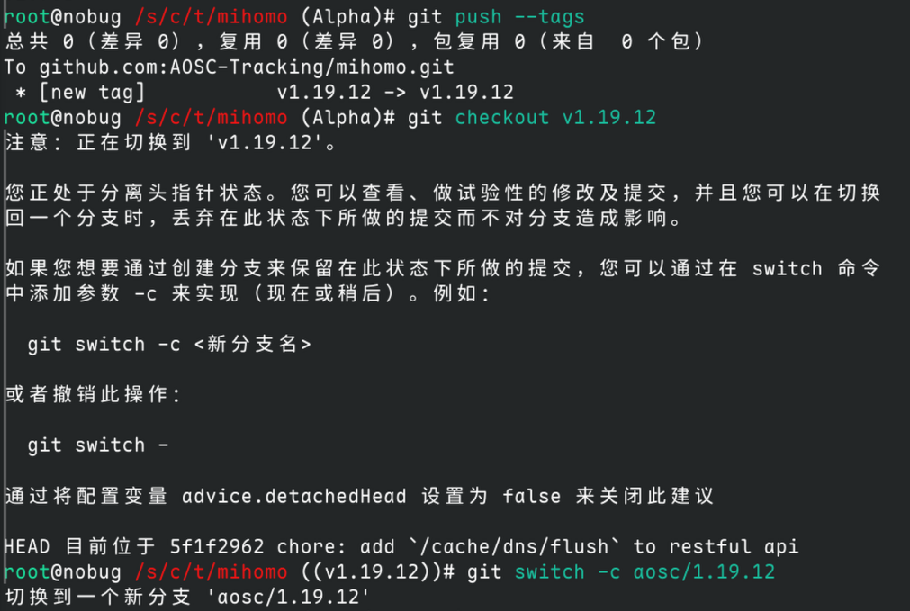

```bash
root@nobug /s/c/t/mihomo (Alpha)# git push --tags 
总共 0（差异 0），复用 0（差异 0），包复用 0（来自  0 个包）
To github.com:AOSC-Tracking/mihomo.git
 * [new tag]           v1.19.12 -> v1.19.12
root@nobug /s/c/t/mihomo (Alpha)# git checkout v1.19.12 
注意：正在切换到 'v1.19.12'。

您正处于分离头指针状态。您可以查看、做试验性的修改及提交，并且您可以在切换
回一个分支时，丢弃在此状态下所做的提交而不对分支造成影响。

如果您想要通过创建分支来保留在此状态下所做的提交，您可以通过在 switch 命令
中添加参数 -c 来实现（现在或稍后）。例如：

  git switch -c <新分支名>

或者撤销此操作：

  git switch -

通过将配置变量 advice.detachedHead 设置为 false 来关闭此建议

HEAD 目前位于 5f1f2962 chore: add `/cache/dns/flush` to restful api
root@nobug /s/c/t/mihomo ((v1.19.12))# git switch -c aosc/1.19.12
切换到一个新分支 'aosc/1.19.12'
```

