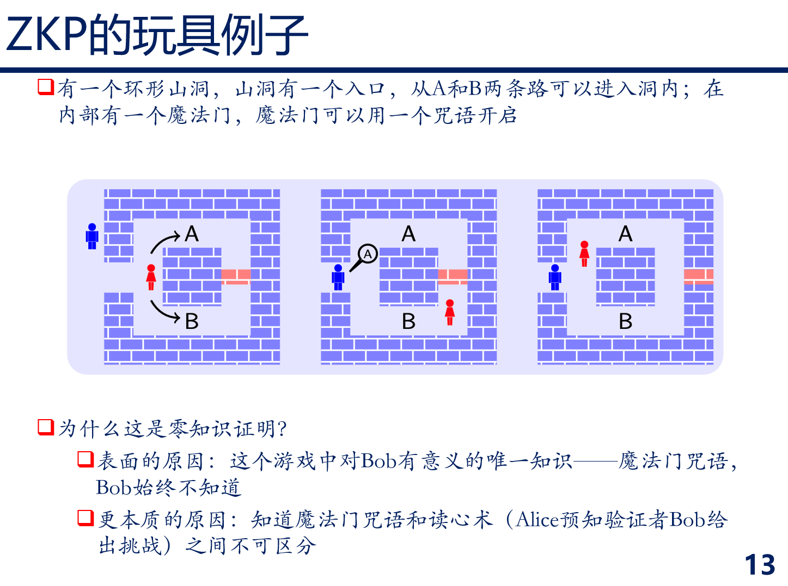
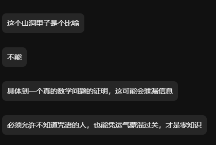

# 密 码 学

## 前向保密

* [Wiki](https://zh.wikipedia.org/wiki/%E5%89%8D%E5%90%91%E4%BF%9D%E5%AF%86)

## 迪菲-赫尔曼密钥交换 DH

* [Wiki](https://zh.wikipedia.org/wiki/%E8%BF%AA%E8%8F%B2-%E8%B5%AB%E7%88%BE%E6%9B%BC%E5%AF%86%E9%91%B0%E4%BA%A4%E6%8F%9B)

## 椭圆曲线迪菲-赫尔曼密钥交换 ECDH

* [Wiki](https://zh.wikipedia.org/wiki/%E6%A9%A2%E5%9C%93%E6%9B%B2%E7%B7%9A%E8%BF%AA%E8%8F%B2-%E8%B5%AB%E7%88%BE%E6%9B%BC%E9%87%91%E9%91%B0%E4%BA%A4%E6%8F%9B)

## Pohlig–Hellman算法

学完密码学了，简单记一下涉及的小问题。

## 零知识证明ZKP

涉及的问题是，如果alice要向bob证明自己知道咒语，为什么alice不直接从a路进去b路出来

因为零知识证明要求即使不知道咒语的人也有几率蒙混过关。原方法的过程中多次重复实验就是为了减小这个概率，但是这个概率始终不为零（1/2^n）

