# Off-The-Record Messaging

原文：

https://robertheaton.com/otr1

*“A dog ate my homework” becomes quite a credible excuse when you ostentatiously purchase twenty ferocious dogs.*

*当你无比显眼的买下二十只凶猛的狗时，“我的作业被狗吃了”就变成了一个相当有说服力的借口。*

这是关于“私密通讯”（OTR）四篇系列文章的开篇引言。OTR是一种加密消息协议，即使使用者的设备被黑客入侵，也能保护其通信内容。

>Off-The-Record 是一个源自新闻采访领域的术语，在信息安全、即时通讯以及日常语境中，含义略有不同，但核心逻辑都是“不记录在案、不留凭证、不可追溯”。

## 第一部分：PGP 的问题

### 0. 引言

假设你想在公园里与朋友进行一次秘密对话。如果你确保附近灌木丛中没有藏人，就可以确信没有人能偷听到你们的谈话。而且，只要你们没有被秘密录音或录像，你同样可以确信，没有人能够为你们的谈话留下永久的、可验证的记录。这意味着，你和朋友可以私下、不留记录地交换意见。公园——乃至整个物理世界——都拥有相当强大且直观的隐私保护特性。

然而，在网络世界中，情况变得更加复杂。网络窃听者无法躲在灌木丛里，但他们可以入侵你的电脑，或者在你传输数据时截获网络流量。现实世界中的大多数对话除了对方的口头陈述外不会留下任何记录，但电子消息会留下“纸质痕迹”，这既可能有用，也可能成为罪证。物理世界与虚拟世界之间的这些差异，未必会增加或减少整体的隐私程度，但它们确实改变了其中对安全和隐私敏感的人需要考虑的威胁和攻击途径。

例如，在物理世界中，通信安全上一时的疏忽通常只会带来有限的后果。它可能让窃听者偷听到某一次对话，或者让某个心怀不满的同伙在拿不出证据的情况下大致复述过去讨论的细节。然而在网络世界中，一时的疏忽可能是灾难性的，其后果甚至可能比泄露机密信息更为严重。

假设一个攻击者窃取了一批电子消息以及解密这些消息所需的秘密密钥——这种情况屡见不鲜。攻击者将能够打开并阅读这些原本秘密的消息。更糟糕的是，他们可能还能利用消息的加密协议向全世界证明这些被窃消息是真实的，从而让受害者无法辩称这些是“应该被忽略的伪造品”。除此之外，攻击者甚至可能利用泄露的秘密密钥，解密多年来使用同一密钥加密的历史消息。

幸运的是，我们可以缓解这些问题。被黑客攻击并不一定意味着你所有的历史消息都会被暴露，也不一定会无意中为被窃消息的真实性提供证明。密码学的内涵远不止加密和解密消息那么简单，其中的细节至关重要。例如：

* 发送方和接收方如何认证彼此的身份？
* 加密密钥从何而来？
* 使用什么算法来加密和解密消息？
* 密钥使用后如何处理？
* 发送方和接收方是否需要生成新密钥？多久生成一次？

“私密通讯”（OTR）是一种加密协议，旨在模拟面对面随意交谈的隐私特性。与大多数加密协议一样，OTR 的主要目标是防止攻击者读取消息内容。但在此基础上，它还保证：即使有人以某种方式获取了 OTR 消息，他们也无法证明这些消息是真实的，而且他们肯定无法解密和阅读成堆的历史消息。任何一个在高级密码学领域摸爬滚打几十年的傻瓜都能设计出一个在一切顺利时足够安全的通信协议。而 OTR 关注的是当事情出问题时会发生什么。

OTR 使用标准的、现成的密码算法来实现这一切，其（相对）简单而精妙之处在于它如何将旧有的工具以新颖的方式组合起来。要理解 OTR 的创新之处，我们无需研读成页的数学证明。相反，我们需要精确地思考那些熟悉的密码学原语在系统层面是如何串联在一起的。OTR 启发了 Signal Protocol 的第一个版本（安全消息应用 Signal 使用的协议），了解 OTR 的工作原理也将激发你自己的密码学想象力。

### 0.1 关于这篇长博文/短书

这篇长博文/短书基于 Borisov、Goldberg 和 Brewer 于 2004 年发表的首次提出 OTR 的[论文](https://otr.cypherpunks.ca/otr-wpes.pdf)。它假设读者几乎不具备密码学方面的先验知识。如果你此前接触过公钥、私钥和加密签名等概念，当然更好，但即便没有也无需担心，我们会涵盖你需要了解的内容。Borisov、Goldberg 和 Brewer 在学术期刊上仅有 7 页的篇幅，而我们拥有充足的空间来介绍背景、厘清细节，并思考 OTR 与 2020 年美国总统选举的交集。

为什么要使用“私密通讯”？
Alice 和 Bob想在网上互相交谈。然而，他们的隐私正受到邪恶的 Eve 的威胁，Eve 想窃听他们的谈话内容并篡改他们的消息。 Alice 和 Bob想要阻止她，安全地交流。为此，他们需要一个加密协议。

Alice 和 Bob需要从协议中获得的两个最基本属性是机密性和真实性。机密性意味着 Alice 和 Bob的消息保持私密，Eve 无法阅读。真实性意味着 Alice 和 Bob可以确信自己在与正确的人交谈，而 Eve 无法伪造虚假消息。

然而，这并不是他们想要的全部属性。假设 Eve 入侵了 Alice 和 Bob的电脑，并窃取了他们的加密密钥。即便在这种灾难性的场景下，Alice 和 Bob也希望确保 Eve 无法利用这些密钥来读取她此前截获的任何过往加密消息。这一属性称为前向保密性。他们还希望阻止 Eve 能够证明她以某种方式窃取的任何消息是真实的。如果 Eve 将他们的消息泄露给媒体，这固然糟糕，但如果他们能够可信地否认这些消息的真实性，情况就没那么糟了。这一属性称为可否认性。

最初的 OTR 论文标题极具挑衅意味：“Off-the-Record Communication, or, Why Not To Use PGP”（私密通讯，或，为何不要使用 PGP）。PGP 是一种广泛使用且简单的加密协议，能提供良好的机密性和真实性，但不具备完美的前向保密性或可否认性。OTR 旨在解决这些不足。

由于 OTR 的诞生源于对 PGP 的挑战，我们将从分析 PGP 的优缺点开始研究 OTR。然后，在掌握了 PGP 的工作原理之后，我们将看到 OTR 如何弥补 PGP 的问题。

### 1.1 PGP

PGP 协议既可用来加密消息（使其保密），也可用来签名消息（证明谁写的）。简而言之，当 Alice 想给 Bob发送消息时，她首先以明文写出消息。她对其进行加密和签名（稍后会详细介绍），然后将密文和签名发送给 Bob。 Bob收到 Alice 的消息后，对其进行解密、验证签名，然后阅读。

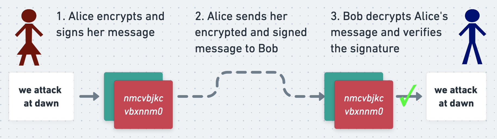

如果 Eve 在 Alice 的消息发送给 Bob的途中拦截了它，她将无法阅读该消息，而且由于签名的存在，她也无法在不被 Bob察觉的情况下篡改它。这意味着 Alice 和 Bob可以在不安全的网络上安全地交换消息。

让我们来看看这一切是如何实现的。

#### 非对称加密

PGP 的核心是使用非对称密码，这是一种加密算法，使用一个密钥进行加密，使用另一个不同的密钥进行解密。在一个人能够接收 PGP 消息之前，他们必须首先生成一对数学上关联的密钥，即密钥对。其中一个是他们的私钥，必须不惜一切代价保密并妥善保存。另一个是他们的公钥，可以安全地公开，供任何人（哪怕是敌人）获取。

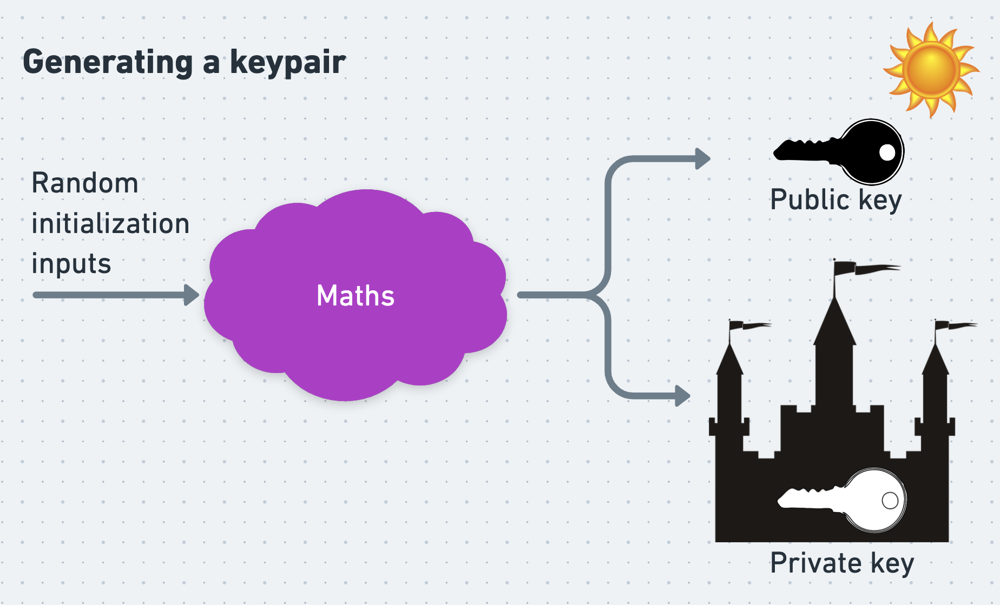

可靠地分发公钥可能异常困难，关于公钥的分发方式、可信模型与不可信模型，已有大量且深入的文献。我曾在别处对这些机制作过阐述，但在这里我们假设 Alice 和 Bob能够毫无障碍地安全获取并信任对方的公钥。

非对称加密的关键特性是：用一个人的公钥加密的数据，只能由对应的私钥解密，反之亦然。

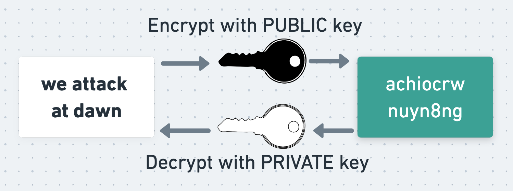

为了理解这种做法为何如此有用，假设 Alice 想要使用非对称密码向 Bob发送一条秘密消息。她做这件事最简单的方式是直接用 Bob的公钥加密消息（尽管正如我们稍后将看到的，PGP的做法有所不同）。为此，Alice 获取 Bob的公钥，并用它加密消息。她将生成的密文发送给 Bob，Bob用自己的私钥解密并阅读消息。

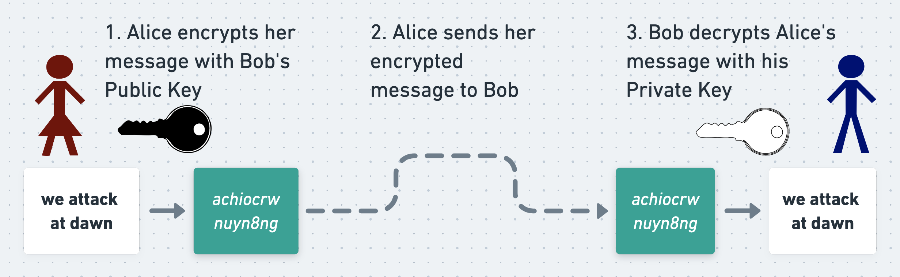

由于消息只能用 Bob的私钥解密，而该私钥只有 Bob自己知道，因此 Alice 和 Bob可以确信，即使 Eve 截获了消息，也无法读取它。

#### 非对称加密有何用处？

非对称加密的一大特点是，它不需要 Alice 和 Bob事先协商一个共享密钥。他们只需要分发自己的公钥即可。他们不担心 Eve 发现这些公钥（只要她没有同时发现他们的私钥），而且他们也完全预料到 Eve 会看到这些公钥。

与非对称加密相对的是对称加密。在对称加密中，加密和解密使用同一个密钥。

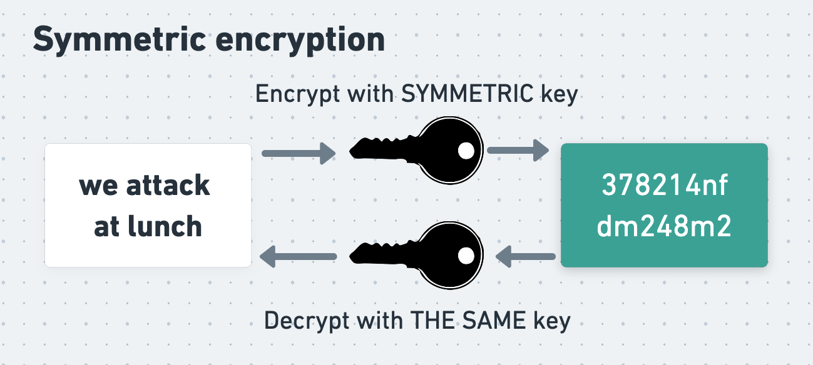

为了使用对称加密交换消息，Alice 和 Bob必须首先协商好他们将使用的对称密钥。这需要谨慎处理，因为他们不能简单地让一方生成一个密钥然后发送给另一方。 Eve 可能会截获该密钥，然后用它解密后续的消息。正如我们将看到的，确实存在多种方法可以让 Alice 和 Bob在不被 Eve 发现的情况下协商出一个共享的对称密钥，但这样做确实需要谨慎。

尽管如此，两类算法本质上没有哪个比另一个更“安全”，一个不知道相关密钥的攻击者无法读取经过任一类型算法强健加密的消息。

#### PGP 如何使用非对称加密

实际上，PGP 同时使用了非对称加密和对称加密。这样做是因为非对称加密速度较慢，尤其是对于长输入。使用非对称密码完整加密一条长消息会耗费难以接受的时间。相比之下，对称加密要快得多。因此，Alice 和 Bob更愿意尽可能多地使用对称加密而非非对称加密来完成加密和解密。但他们如何才能在不被 Eve 看到的情况下协商出一个用于对称加密的共享密钥呢？

PGP 通过一个巧妙的技巧兼得二者之长。在 PGP 中，Alice 并不使用非对称加密来加密整条消息。相反，她使用对称加密来加密消息，所用的是一个她生成的随机对称密钥，称为会话密钥。

为了让 Bob能够解密她的消息，Alice 需要将会话密钥发送给他。她还需要确保 Eve 无法读取该密钥。为此，她使用 Bob的公钥加密会话密钥。现在，如果没有 Bob的私钥，Eve 就无法恢复会话密钥——不出意外的话，只有 Bob知道这个私钥。既然 Eve 无法恢复会话密钥，她也就无法解密 Alice 的实际消息，即使她截获了 Alice 和 Bob交换的每一个字节。因此，Alice 可以放心地将对称加密的消息和非对称加密的会话密钥一起发送给 Bob。

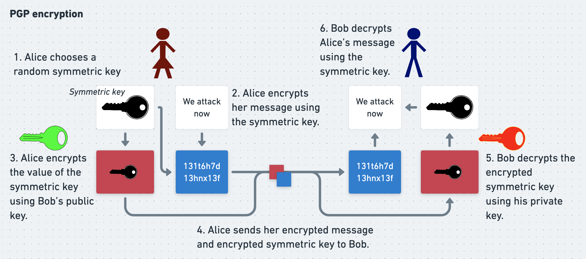

要阅读 Alice 的消息，Bob只需反向执行 Alice 的操作流程。他用私钥解密得到对称会话密钥，再用该会话密钥解密实际的消息。通过PGP，Alice 和 Bob同时获得了非对称密码学的便利和对称密码学的速度。

#### 数字签名

然而，尽管 Bob是唯一能阅读 Alice 消息的人，但此时他并没有证据证明这条消息确实是 Alice 所写。在他看来，这条消息可能是 Eve 冒充 Alice 生成并加密的，也可能是 Eve 截获了 Alice 的真实消息并进行了篡改。为了向 Bob证明消息是她写的，Alice 在发送前使用PGP对消息进行数字签名。

数字签名是附加在消息上的一段数据，使接收方能够自行验证消息的作者身份，也能让自己确信消息未被篡改。签名可以通过多种不同方式生成，其中就包括 Alice 和 Bob刚刚用于加密消息的那种非对称密码学技术。

在使用非对称密码学进行消息加密和解密时，Alice 和 Bob利用的是这样一个事实：用公钥加密的消息只能用对应的私钥解密。而在进行消息签名时，他们利用的是与之对应但方向相反的事实：用私钥加密的消息只能用对应的公钥解密。

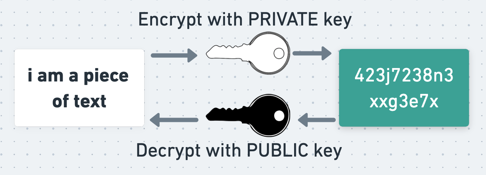

为了生成一个“朴素签名”，Alice 可以取她加密后的消息，再用自己的私钥加密一次。这一操作的结果就是消息的签名。她可以将这个签名附加到加密消息上，将两者一起发送给 Bob。

这个签名之所以有用，是因为 Bob可以用 Alice 的公钥解密签名，并验证解密结果是否等于 Alice 的加密消息。这向 Bob证明，签名是用 Alice 的私钥生成的，因此该消息确实由 Alice 签名和撰写。 Bob还知道消息在传输过程中没有被篡改，因为如果被篡改过，解密签名得到的结果就不再等于加密后的消息。要想篡改消息而不被发现，Eve 需要同时更新签名。然而，由于她不知道 Alice 的私钥，无法为她篡改后的消息生成有效的签名。

这就是所有类型密码学签名背后的基本原理。

#### 实践中的密码学签名

在实践中，Alice 并不会直接对加密后的消息进行签名。这是因为，如我们所知，非对称加密速度较慢。除此之外，对整个消息进行签名会产生与消息长度相同的签名，这会占用不必要的带宽。更重要的是，短消息会产生短签名，这可能会让攻击者即使不知道 Alice 的私钥，也更容易伪造签名。

因此，Alice 首先将消息输入哈希函数——一种针对给定输入产生看似随机但输出一致且长度固定的算法。然后，她用自己的私钥对哈希函数的输出进行签名。

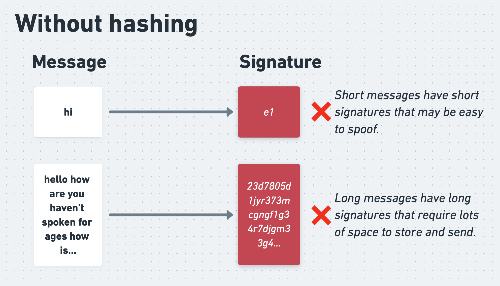

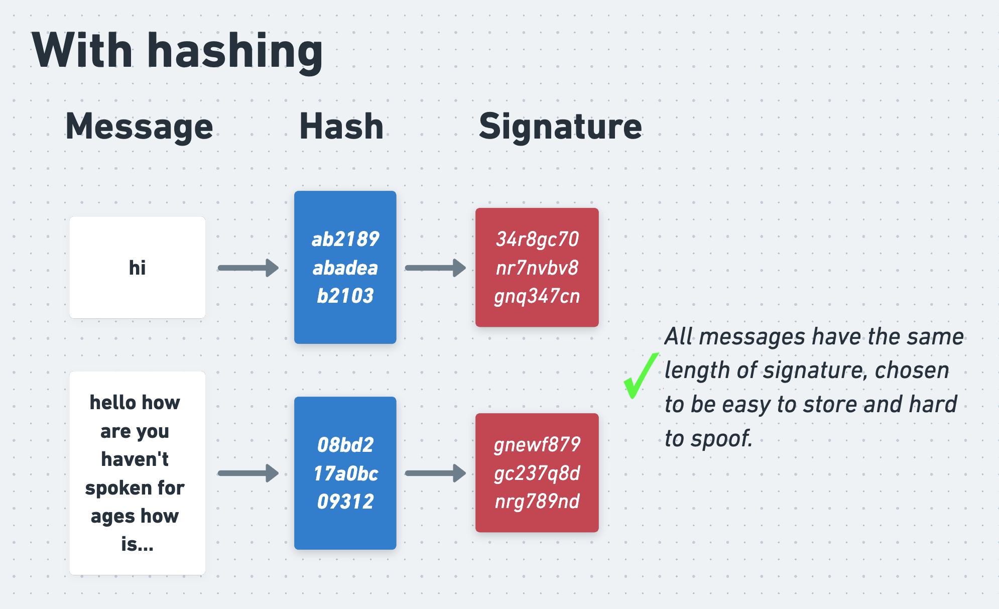

综上所述，我们可以得到如下流程：

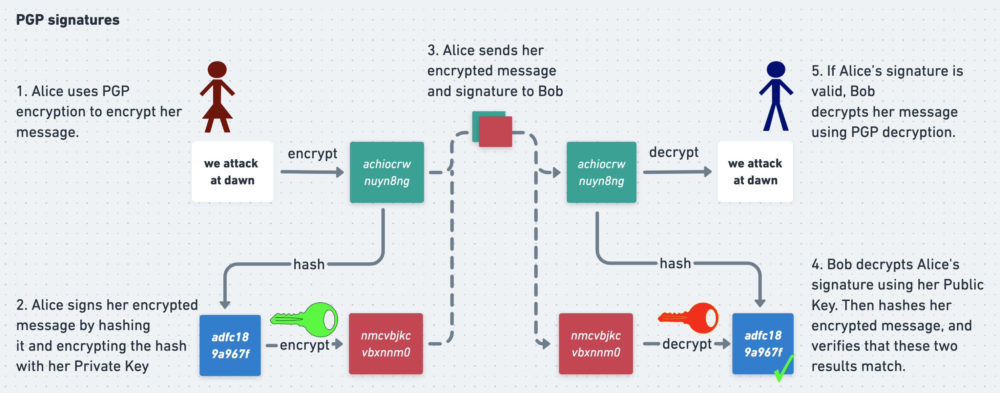

当 Bob收到 Alice 的消息和签名时，他也使用哈希函数来验证签名。他用 Alice 的公钥解密签名，但并不是直接将解密结果与消息本身比对，而是先对消息进行哈希，然后将哈希值与解密得到的签名进行比对。如果两者匹配，Bob就可以确信消息是真实的。

### PGP 的问题

加密和签名是 PGP 为 Alice 和 Bob提供机密性和真实性的方式。我们已经看到，Eve 无法解密 Alice 的消息，因为她不知道 Bob的私钥，因此无法解密对称会话密钥。她也无法伪造从 Alice 发给 Bob的虚假消息，因为她不知道 Alice 的私钥，所以无法生成有效的签名。如果一切顺利，PGP 就能完美地工作。

然而，在现实世界中，我们还必须为“一切并不完美”的时刻做好打算。这正是 PGP 的不足之处，也是 OTR 力图改进的地方。PGP 严重依赖于私钥的保密性。如果用户的私钥被窃取（例如，他们的电脑被黑客入侵，所有文件被盗），那么此前由该私钥支撑的安全属性就会土崩瓦解。假设 Eve 偷到了 Bob的私钥副本，并在 Alice 的消息发送给 Bob的途中将其截获。她将能够解密 Alice 用 Bob公钥加密的会话密钥，然后用这些密钥解密 Alice 的消息。如果她偷到了 Alice 的私钥副本，就可以用它来签名 Eve 自己编写的虚假消息，让这些消息看起来像是来自 Alice 。

所有加密方案在一定程度上都建立在“私钥保持私密”这一假设之上，因此如果这一假设被打破，任何协议都会遭受严重损害，这本在预料之中。但对于 PGP 来说，其后果不仅仅是泄露机密信息。我们已经知道，如果 Eve 窃取了私钥，她就可以用它来解密她截获的、任何未来使用对应公钥加密的 PGP 消息。但假设 Eve 已经监听 Alice 和 Bob数月或数年，耐心地存储了他们所有的加密通信记录。此前她无法读取这些通信内容，但现在有了 Bob的私钥，她就可以解密所有历史会话密钥，并用它们来解密所有旧的、原本秘密的消息。

但情况甚至更糟。 Alice 对所有 PGP 消息都进行了加密签名，这样 Bob才能确信消息的真实性。然而，生成签名需要 Alice 的私钥，而验证签名只需要她的公钥——公钥通常是公开可获取的。这意味着，Eve 可以像 Bob一样，利用 Alice 的签名来验证她从 Bob那里窃取的消息的真实性。如果 Eve 获得了 Alice 和 Bob带签名的消息，她就同时获得了一份可通过密码学验证的通信记录。这使得 Alice 和 Bob无法可信地否认被窃消息的真实性。在接下来的几节中，我们将看到一些现实世界的例子，说明此类加密签名如何给黑客攻击的受害者带来严重问题。

PGP 确实提供了机密性和真实性。但它很脆弱，对于私钥泄露缺乏韧性。理想情况下，我们希望有一种加密协议，能更好地减轻被黑客攻击带来的后果。具体来说，我们希望得到两个额外的属性。首先是可否认性，即用户能够可信地否认曾经发送过被泄露的消息。其次是前向保密性，即即使攻击者窃取了用户的私钥，仍然无法读取过去使用该密钥对加密的通信内容。

在本系列的第二部分，我们将详细探讨这两个属性，并说明它们为何如此重要。然后在第三和第四部分，我们将探讨“私密通讯”（OTR）的工作原理，以及它是如何提供这些属性的。

## 第二部分：可否认性与前向安全性

这是一篇由四部分组成的系列文章的第二部分，主题关于“私密通讯”（OTR）——一种加密消息传输协议，即使使用者遭到入侵，该协议也能保护其通信内容。在第一部分中，我们探讨了常见加密消息协议（如PGP）存在的问题。我们还探讨了消息协议应当具备的两项理想特性：保密性与真实性。在本篇（第二部分）中，我们将研究另外两个更重要的特性——可否认性和前向安全性——并将会发现许多协议都未能做到这两点。随后，我们将在第三和第四部分中，具体了解OTR的运作方式，以及它是如何一一实现保密性、真实性、可否认性和前向安全性的。

### 可否认性

可否认性是指一个人能够令人信服地否认自己知晓或做过某件事的能力。这是OTR的主要关注点之一，却是PGP的主要弱点之一。

当面交谈中所说的话通常很容易否认。如果你声称我告诉过你我抢了一家银行，我可以令人信服地反驳说我没有，而你也无法证明。

电子邮件对话也可以否认（尽管下文会分析为什么在实践中往往并非如此）。假设你把一封电子邮件的内容转发给一名记者，邮件中我似乎在描述我抢劫一百家银行的计划。我可以信誓旦旦地说是你编辑了这封邮件，或者干脆是你伪造的，而你仍然无法证明我在撒谎。公众、警方或者法官或许会采信你的说法而非我的，但这其中没有任何数学意义上的确凿证据，我们便沦入了主观判断这片浑水之中。

相比之下，我们之前已经看到，经PGP签名的消息是不可否认的。如果 Alice 签署了一条消息并将其发送给 Bob ，Bob 可以使用PGP签名来验证该消息的真实性。然而，这种验证所需的仅仅是 Alice 的公钥，而公钥是公开可得的。这意味着任何获得该消息的人都可以像 Bob 一样验证签名，并证明这条消息确实是 Alice 发出的。因此，Alice 发送这些消息的记录将永久留存。如果 Eve 入侵了 Bob 的消息系统，或者 Alice 与 Bob 闹翻后，Bob 将他们过去的通信记录转发给她的敌人，Alice 就无法像从未签名时那样，令人信服地否认曾发送过这些消息。如果你向记者转发了一封经过加密签名的电子邮件，其中我描述了我抢劫一千家银行的计划，那我可就吃不了兜着走了。

乍看之下，可否认性与真实性之间存在冲突。真实性要求 Bob 能够向自己证明某条消息确实是 Alice 发出的。而可否认性则要求 Alice 能够否认曾发送过同一条消息。正如我们即将看到的，OTR最有趣的创新之一，就是它如何同时实现这两个看似矛盾的目标。

从技术角度讲，任何事情都可以否认，哪怕是加密签名。我总可以声称有人偷了我的电脑并猜到了我的密码，或者给我的电脑植入了恶意软件，又或者在我让别人用我的电脑查足球比分时，他们趁机偷走了我的私钥。这些说法并非不可能，只是不太可信，而且很难辩得清。可否认性是一种可信程度上的浮动尺度，因此OTR不遗余力地让否认变得更为可信，从而更具说服力。“狗吃了我的作业”这种借口，如果你前一天大张旗鼓地买了二十条凶狗，那它可就可信多了。

相信一条可否认的消息仍然是真实的，这完全合情合理。我们每天都在没有数学证明的情况下，凭借模糊的概率权衡来评估和相信成百上千的说法。即便没有加密签名，一张WhatsApp对话的截图，也完全有理由让执法部门相信我抢劫一万家银行的计划。

但正如我们接下来要看到的，如果有签名可用，事情确实会变得简单得多。

#### DKIM、波德斯塔邮件与亨特·拜登的笔记本电脑
对于消息发送者来说，可否认性几乎总是一个理想属性。你说过或写下的每一句话，都有可能成为日后反过来让你遭殃的、无法抹去的记录，而这样做几乎没有任何好处。但这并不是说可否认性就是一个客观上让世界变得更美好的好东西。我们只需看看DKIM邮件验证协议、美国民主党政治幕僚约翰·波德斯塔，以及美国总统乔·拜登之子亨特·拜登的笔记本电脑这几段相互交织的往事，就能明白其中的纠葛。

要理解这些事件背后的政治风波，我们首先需要了解相关协议。在过去，当一家邮件服务商收到一封声称来自rob@robmail.com的邮件时，服务商无法验证这封邮件是否真的是从rob@robmail.com发出的。因此，服务商通常只能硬着头皮，祈祷邮件是合法的，然后予以接收。垃圾邮件发送者利用这种信任机制，向人们的收件箱狂轰滥炸大量伪造邮件。DKIM协议诞生于2004年，旨在让邮件服务商能够验证所接收邮件的真伪，该协议沿用至今。

DKIM使用了与PGP许多相同的技术。为了使用DKIM（即Domain Keys Identified Mail，域名密钥识别邮件），邮件服务商会生成一对密钥，并将公钥向全世界公开（通过DNS TXT记录，具体机制我们这里不做赘述）。当用户发送邮件时，其邮件服务商会使用自己的私钥为该邮件生成一个签名，并将该签名作为邮件头信息插入到发出的邮件中。

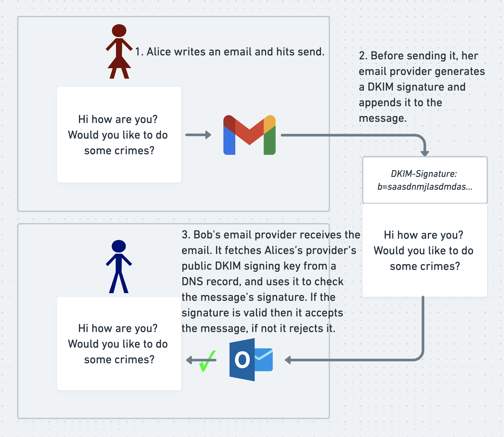

当收件方的邮件服务商收到邮件时，它会查询发件方服务商的公钥，并用该公钥根据邮件内容验证 DKIM 签名，就像收件人将 PGP 消息的签名与其内容进行比对验证一样。如果签名有效，接收方服务商就接收该邮件；如果无效，则认定邮件为伪造并拒绝接收。由于垃圾邮件发送者无法获取邮件服务商的签名密钥，因此无法生成有效的签名。这就意味着他们无法伪造出能通过 DKIM 验证的邮件，使得 DKIM 在检测和防范邮件伪造方面非常拿手。

但正如我们在 PGP 中看到的那样，凡是有加密签名的地方，就可能存在“可否认性”的问题。DKIM 签名除了提供身份认证外，还会提供永久、不可否认的证据，证明被签名的邮件是真实的。DKIM 签名是邮件内容的一部分，因此会保存在收件人的收件箱中。如果黑客从收件箱中窃取了所有邮件，他们可以使用发件方服务商的 DKIM 公钥自行验证这些签名，就像当初收件方服务商收到邮件时做的那样。攻击者自己亲手窃取了这些邮件，自然已经知道它们是真实的。然而，DKIM 签名还让他们能够向持怀疑态度的第三方证明这一点，从而彻底消除了邮件的可否认性。邮件服务商会定期更换（或称轮换）其 DKIM 密钥，这意味着它们当前在 DNS 记录中的公钥可能与当初用来签署邮件的密钥不同。但对攻击者来说幸运的是，许多大型邮件服务商过往的 DKIM 公钥都可以在互联网上轻易找到。

约翰斯·霍普金斯大学教授马修·格林指出，让邮件以这种方式变得不可否认并非 DKIM 协议的目标之一。这更像是一个 DKIM 最初设计和部署时未曾预料到的奇特副作用。格林认为，DKIM 签名使得邮件被黑变成了一项回报丰厚的“生意”。对记者或外国政府而言，很难相信通过层层关系转手得到的、未经签名的被盗邮件，因为这条漫长链条中的任何一个人都可能伪造或篡改邮件内容。然而，如果这些邮件带有由可信第三方（比如知名邮件服务商）生成的加密 DKIM 签名，那么无论提供邮件的人多么不可靠，这些邮件都可以被证明是真实的。加密签名不会因社会关系疏远或来源可疑而失效。数据窃贼可以借力于 Gmail（或其他任何 DKIM 签名者）的信誉，使得被盗的、带有签名的邮件成为可验证的、因而更有价值的“商品”。

这给现实世界带来了实际问题。2016 年 3 月，维基解密公布了从美国民主党工作人员约翰·波德斯塔的 Gmail 账户中窃取的邮件。维基解密在发布每封邮件时，还附带了由 Gmail 或发件方服务商生成的相应 DKIM 签名。这使得公众能够独立验证这些邮件的真实性，从而让波德斯塔无法辩称这些邮件是“由说谎者捏造的胡言乱语”。

你可能认为波德斯塔邮件被黑这件事，本身要么对民主是件好事，要么对普通公民个人而言是件糟糕的事。你可能相信 DKIM 签名的长期可验证性是一种有助于提高透明度的社会美德，也可能认为它是一个助长邮件窃取行为的败笔。但无论你持何种观点，你都得承认，约翰·波德斯塔肯定希望他的邮件没有那种持久的来源证明，而且大多数个人邮箱用户也希望自己的邮件能以“可否认”“非记录”的方式发送。

针对这个问题，马修·格林提出了一个看似反常但很巧妙的解决方案。Google 本来就在定期轮换 DKIM 密钥。这样做是出于最佳安全实践，以防密钥在未被察觉的情况下遭到泄露。格林建议，当 Google（及其他邮件服务商）轮换掉一个 DKIM 密钥对并使其退役后，应当将该密钥对的私钥公之于众。

这听起来有些奇怪。公布 DKIM 私钥意味着任何人都可以用它来为邮件伪造一个看似有效的 DKIM 签名。如果该密钥对仍在使用，这就会让 Google 的 DKIM 签名完全失效。然而，由于密钥对已经退役，公开私钥并不会以任何方式影响 DKIM 的有效性。DKIM 的作用是让收件人在收到邮件时验证该邮件的真实性。一旦收件人验证并接收了邮件，以后就无需再重新验证。该签名没有其他用处，除非有人——比如攻击者——之后想证明某封邮件的来源。

由于 DKIM 只要求签名在邮件收到时有效且可验证，因此攻击者能否为旧邮件伪造签名并不重要。事实上，这正是我们想要的效果，因为它让所有由邮件服务商使用现已公开的私钥合法生成的 DKIM 签名都变得毫无价值。假设攻击者窃取了一堆旧邮件，其中包含许多由 Gmail 发送并带有使用 Gmail 现已公开的私钥生成的 DKIM 签名的邮件。在此之前，只有 Google 能生成这些签名，因此签名本身就证明了邮件的真实性。但现在，由于旧的私钥已经公开，任何人都可以自己生成有效的签名。伪造者只需获取邮件服务商现已公开的 DKIM 私钥以及自己想要签名的邮件内容，然后用该密钥为邮件签名，就像对 PGP 消息签名一样。最后，他们将得到的签名作为邮件头添加到邮件中，就像邮件服务商所做的那样。

这意味着，除非窃取了一堆带签名邮件的攻击者能够证明这些签名是在密钥仍为私有时生成的（这一点通常无法证明），否则对于持怀疑态度的第三方而言，这些签名什么都证明不了。即使攻击者确实窃取了这些邮件，且仅仅是在从事单一层面的简单违法行为，上述结论依然成立。

但是，这一切究竟能带来多大改变呢？如果没有这些签名，人们难道就不会相信波德斯塔邮件了吗？或许吧。但再考虑一个更近的例子，我认为如果有 DKIM 签名可用，甚至可能改变历史的走向。

2020 年美国总统竞选期间，共和党工作人员声称他们获取了一台属于时任民主党候选人（现总统）乔·拜登之子亨特·拜登的笔记本电脑。共和党人称，这台电脑里藏有大量关于拜登家族的爆炸性邮件和信息，会让公众震惊。

共和党人据称获得了这台笔记本电脑，其故事颇为离奇，来龙去脉还要从特拉华州一个小镇的电脑维修店说起。不过，离奇的故事有时也是真的，而密码学签名恰恰就能在这种情形下为确立可信度发挥关键作用。只要签名验证无误，故事再离谱都不打紧。事实上，为了证明这台笔记本电脑的来源，共和党人公布了一封电子邮件，附带一个DKIM签名，并声称该邮件就出自这台电脑。

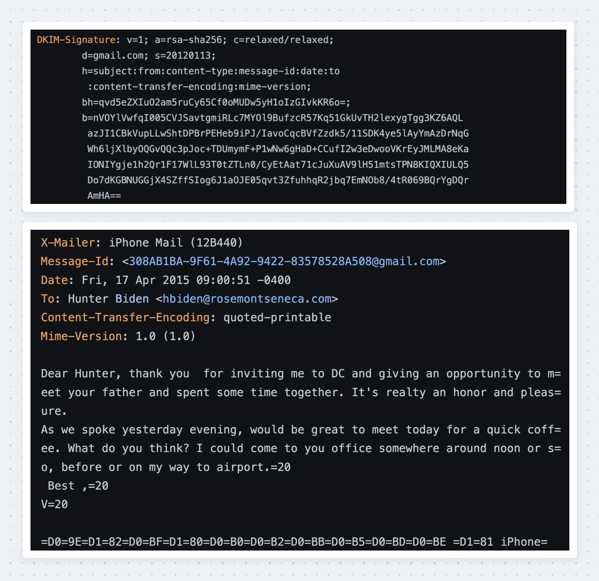

这封邮件的 DKIM 签名是有效的，结合邮件正文（未在以上展示）来看，确实可以证明 v.pozharskyi.ukraine@gmail.com 在 2012 至 2015 年间（DKIM 签名密钥有效期内）曾向 hbiden@rosemontseneca.com 发送过一封关于会见收件人父亲的邮件。然而，这封邮件也引发了诸多疑问，并很好地展示了“可否认性”是一个有程度之分的概念。

这封邮件能证明的，仅限于它字面所说的内容。它不能证明 v.pozharskyi.ukraine@gmail.com 这个账号背后的人是谁（尽管其他证据可能可以），不能证明还有成千上万封类似的邮件，也不能证明这封邮件来自所谓的笔记本电脑。

这封邮件在密码学上是可以验证的，但如果没有更多证据，其所关联的说法仍然是可以合理否认的。我猜测，如果能像维基解密公开波德斯塔邮件那样，将全部邮件和签名批量公开，那么这些材料的整体力量可能足以推翻许多间接的否认。如果共和党当时手中还掌握着一批同样可以通过密码学方式验证的其他材料，那就很难理解他们为何只公开了这封孤立的、并不那么劲爆的邮件。也许 2020 年大选的结果会有所不同。密码学意义上的可否认性，至关重要。

---

你不能否认我们已经深入地学习了可否认性，那么现在让我们来看看“私密通讯”提供的另一个重要特性：前向保密性。

### 前向保密性

Alice 和 Bob 再次通过网络连接交换加密消息。 Eve 在截获他们的通信，但由于消息是加密的，她无法读取。不过，Eve 决定将 Alice 和 Bob 的加密通信流量存储下来，以防将来能用得上。

一年后，Eve 攻破了 Alice 和 Bob 其中一方或双方的私钥。对于许多加密协议而言，Eve 此时就可以翻出她之前的存档，利用新获得的密钥，解密多年来存储的所有加密消息。这将是一场灾难。然而，如果 Alice 和 Bob 当时使用的是一种具备“前向保密性”这一卓越特性的加密协议，那么即使 Eve 拿到了他们的私钥，也无法解密他们过往的通信记录。

以下是维基百科对前向保密性的定义：

>前向保密性是特定密钥协商协议的一种特性，它能保证即便服务器的私钥被攻破，你的会话密钥也不会泄露。（维基百科）

我们在第一部分已经看到，PGP 并不提供前向保密性。假设 Eve 存储了加密的 PGP 通信记录，后来攻破了 Bob 的私钥。此时，Eve 就可以用 Bob 的私钥，解密所有历史上 Alice 用 Bob 公钥加密过的会话密钥。这意味着，她可以利用这些会话密钥，在通信发生很久之后，解密 Alice 对应的全部消息。

要防止这种情况发生，Alice 和 Bob 需要一个会话密钥交换过程，确保即便 Eve 目睹了他们全部的密钥交换流量，甚至攻破了他们的私钥，也无法推算出会话密钥的值。OTR 的原始版本通过一种名为“迪菲-赫尔曼”的密钥交换协议（其他类似协议也可实现）实现了这一卓越特性，我们将在后文中详细探讨。

为了完整地实现前向保密性，Alice 和 Bob 需要在每次会话结束后“遗忘”该会话密钥，将其从内存、硬盘以及任何攻击者在入侵他们电脑后可能恢复该密钥的地方彻底清除。如果 Alice 和 Bob 使用像迪菲-赫尔曼这样精心设计的密钥交换协议来协商会话密钥，并在不再需要时彻底遗忘它们，那么任何人都无法推算出这些会话密钥的值——无论是攻击者，还是 Alice 和 Bob 本人。因此，在任何情况下，任何人都无法解密那些使用已被遗忘的会话密钥加密的通信或加密消息存档。至此，前向保密性——OTR 的核心目标之一——得以实现。

前向保密性常被称为“完美前向保密性”，包括许多知名密码学家在内都这样称呼。而另一些同样知名的密码学家则反对使用“完美”一词，因为（我的理解是）它暗示了过多的承诺。没有什么是完美的，即便前向保密性协议实现正确，在发送方和接收方完成对会话密钥的“遗忘”之前，其保证并非完美。从消息被加密到密钥被遗忘之间，存在一个时间窗口，一个足够强大的攻击者仍有可能从参与者的内存或其他存储过密钥的地方窃取该会话密钥。在实践中，前向保密性的保障仍然强大且卓越。但在讨论“私密通讯”时——这个协议存在的全部意义就在于应对各种失效情况——我们恰恰应该考虑这类边缘场景。我们将在后面的章节中进一步讨论。

---

显而易见，保密性和真实性是安全通信协议令人向往的特性。保密性防止攻击者读取 Alice 和 Bob 的消息，而真实性则让 Alice 和 Bob 确信他们正在与正确的人通信，并且消息未被篡改。

我们也看到了可否认性和前向保密性为何重要。可否认性让参与者能够在密钥泄露时可信地声称自己并未发送过某些消息。这还原了现实对话中的隐私特性，并减轻了数据泄露带来的危害。前向保密性——我们讨论的另一个特性——则防止攻击者读取历史加密消息，即使他们攻破了加密过程中使用的长期私钥。

OTR 的目标是同时实现所有这些特性，现在我们已经准备好看看它是如何做到的。在本系列的第三部分，我们将探讨 OTR 的交换过程，然后在第四部分深入分析其设计决策。

## 第三部分：OTR 的工作原理

这是关于“私密通讯”（OTR）四篇系列文章的第三篇。OTR是一种加密消息协议，即使使用者的设备被黑客入侵，也能保护其通信内容。在第一篇和第二篇中，我们探讨了PGP等常见加密消息协议存在的问题，并提出了消息协议应具备的四个理想特性：保密性、真实性、可否认性和前向保密性。在本篇文章（第三篇）中，我们将了解OTR的工作原理及其如何实现上述每一项特性；随后在第四篇中，我们将深入剖析OTR的一些关键见解。

“私密通讯”是如何工作的？
概括来说，OTR的交换过程与许多其他加密协议类似。

为了交换一条OTR消息，发送方和接收方必须：

1. 协商一个秘密的加密会话密钥
2. 验证彼此的身份

随后，发送方必须：

3. 加密消息
4. 对消息进行签名
5. 发送消息

接收方则必须：

6. 解密消息并验证其签名

接着，发送方必须：

7. 公开之前使用的签名会话密钥（是的，这一点出人意料）

最后，发送方和接收方都必须：

8. 遗忘加密会话密钥，以保持前向保密性

这听起来足够简单明了，但OTR对可否认性和前向保密性近乎偏执的追求意味着，那些看似简短的要点的背后，其实暗藏大量细微之处。此外，我还暂时略过了一些额外步骤，因为等到我们讲到那里时，它们才会变得清晰起来。

让我们从头开始。

### 1. 协商一个秘密的加密会话密钥

Alice 和 Bob 首先协商一个共享的、对称的、临时的会话密钥。之后，他们将使用该密钥通过对称加密算法对消息进行加密。为了保持前向保密性，每次完成消息交换后，他们都会遗忘用于发送该消息的会话密钥，并重新协商一个新的密钥。至于他们以何种频率协商新密钥，原始OTR论文中有详细讨论，但对我们而言，可以假设会话密钥大约每条消息更换一次。

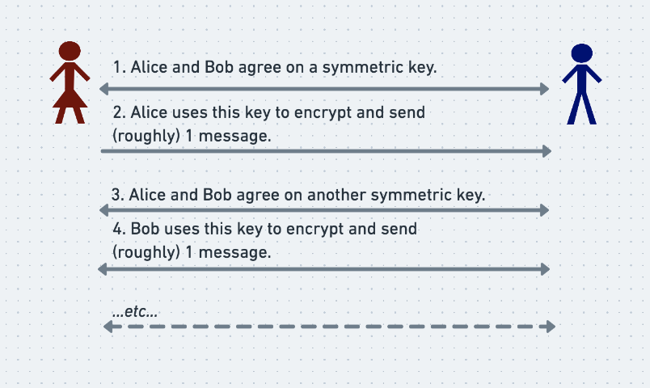

Alice 和 Bob 通过 Diffie-Hellman 密钥交换安全地协商出共享的密钥，而不会让窃听者 Eve 发现它们，这一点在前面简单提过。要解释 OTR 协议，并不需要深入 Diffie-Hellman 复杂的内部机制，但有一个大致的了解仍然是有益的。

Diffie-Hellman 密钥交换
简单来说，要开始一次 Diffie-Hellman 密钥交换，Alice 和 Bob 各自选择一个随机的秘密数字。他们各自向对方发送一个经过特殊构造的中间数字，这个数字由他们自己的随机秘密数字推导得出，但并非秘密数字本身。此时，双方都知道自己的随机秘密数字，以及对方发来的中间数字。得益于 Diffie-Hellman 协议的精心设计，双方都可以用自己的秘密数字和对方的中间数字推导出同一个最终的秘密密钥，用作本次通信的会话密钥。

即使 Eve 偷看了双方的通信，看到了他们交换的两个中间结果，她仍然无法计算出最终的秘密密钥，因为她不知道他们各自最初的随机秘密。

维基百科上有一个用颜料代替数字的好类比，如果没弄明白，也不用担心，具体细节对我们来说并不重要。重要的是，迪菲-赫尔曼协议能让 Alice 和 Bob 在保证前向安全性的前提下协商出一个共享的对称密钥，并且阻止 Eve 获知该密钥。

### 2. 验证身份

我们刚才介绍了 Alice 和 Bob 如何协商出一个共享的会话密钥，用于对称加密。但是，我们还没有考虑如何验证与他们协商出该密钥的对方的身份。目前，Eve 有可能拦截并阻断 Alice 和/或 Bob 的所有通信流量，然后亲自冒充双方，分别与 Alice 和 Bob 各进行一次迪菲-赫尔曼密钥交换！ Alice 和 Bob 各自以为与对方协商出了共享密钥，但实际是与 Eve ，而非与对方。这样，Eve 就能阅读他们的消息，并伪造回复发给他们，而 Alice 和 Bob 根本无法知道发生了什么。这就是所谓的中间人攻击。

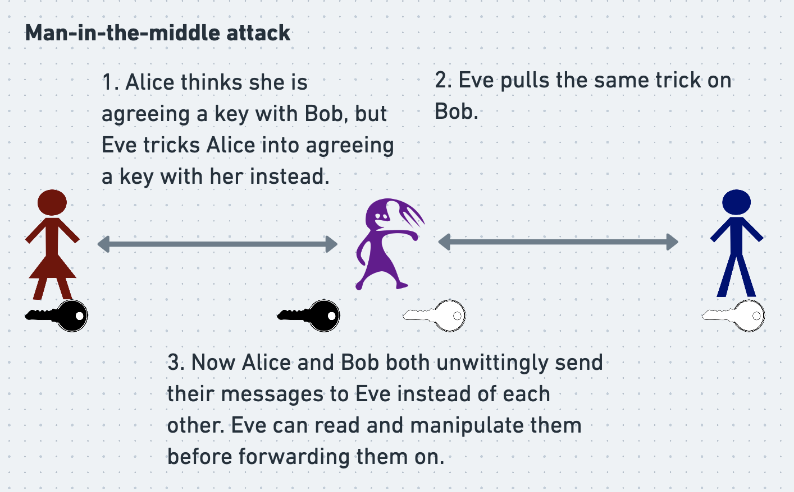

尽管OTR不使用非对称加密来加密消息，但在身份验证环节确实用到了非对称加密。在最初的那篇论文中（Borisov、Goldberg 和 Brewer，2004年），设计OTR的研究者们提出了一种精巧的方法，让 Alice 和 Bob 在进行迪菲-赫尔曼密钥交换时，可以利用公钥/私钥对来验证彼此的身份。

然而，几年后发表的另一篇论文（Alexander 和 Goldberg，2007年）指出了这种方法存在的一个弱点。该论文提出了一种大体相似但更为复杂的替代方案。此处我们将讨论原始的流程（尽管略有缺陷），因为它更简单，并且仍然能够很好地阐释对密钥交换进行身份验证的一般原理。

在最初的OTR方案中，为了向对方证明自己的身份，Alice 和 Bob 各自对自己发送给对方的迪菲-赫尔曼中间值进行了签名。随后，当收到经过签名的中间值时，他们会用对方的公钥验证该签名。如果签名验证不通过，他们就中止对话；如果验证通过，他们就可以确信，与该中间值对应的秘密值，只有签署该中间值的人才知道。于是，他们可以将该中间值与自己的秘密值结合起来，生成共享的对称密钥。这一过程旨在让 Alice 和 Bob 都能确信，他们正在与正确的人协商共享密钥。

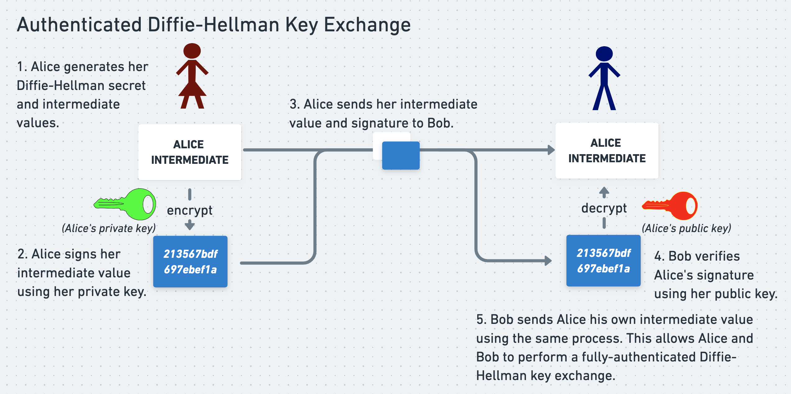

Eve 仍然可以拦截并试图篡改 Alice 和 Bob 之间的通信。然而，她无法让他们接受一个由她自己随机秘密推导出的 Diffie-Hellman 中间值，因为她无法生成有效的签名。因此，她无法诱使他们与自己建立加密连接。

然而，Alexander 和 Goldberg 在 2007 年的研究中表明，Eve 仍然可以通过其他方式操纵这种密钥交换。 Eve 可以让 Alice 和 Bob 相互建立连接，但却让 Bob 误以为自己在与 Eve 通话，而实际上他是在与 Alice 通话。 Eve 虽然无法实际读取任何消息，但这种程度的“猫腻”对于一个原本健壮的协议而言，仍然是不可接受的。

因此，OTR 现在采用了 Alexander 和 Goldberg 2007 年提出的更为精巧的方案： Alice 和 Bob 先使用基础版 Diffie-Hellman 建立一个加密但未认证身份的连接，然后在该加密通道内部互相认证对方的身份。

细心的读者可能会感到惊讶：OTR 竟然曾经用签名来验证参与者的身份？我们不是一直在说公钥/私钥加密签名是可否认性的“敌人”吗？难道我们已经忘了约翰·波德斯塔？

然而，Alice 和 Bob 从未用他们的私钥对实际消息进行签名。他们签名的只是自己的密钥交换中间值，而这些签名所能证明的，仅仅是 Alice 和 Bob 交换了两个看起来像随机数的数字。它们无法证明 Alice 和 Bob 消息内容方面的任何信息，这意味着他们对话的实质内容仍然是完全可否认的。

话虽如此，Alice 和 Bob 仍然需要以某种方式对他们的消息进行签名，以认证消息内容并确保其未被篡改。我们很快会看到他们是如何在保持可否认性的同时做到这一点的。

目前，Alice 和 Bob 已经协商出一个共享的、对称的、临时的会话密钥，并验证了彼此的身份。接下来，Alice 需要加密她的消息。

### 3. 加密消息

至此，Alice 和 Bob 已经协商出一个秘密的对称会话密钥。现在我们需要指定一个对称加密算法（或称密码），让他们可以将密钥输入其中，以加密和解密消息。这类加密算法早已存在，OTR 可以直接使用现成的算法，无需自行发明。

出于某种我们稍后会讨论的反直觉的原因，OTR 需要一种可延展性密码。可延展性密码是指攻击者能够操纵密文，使其解密后变成攻击者所选定的替代明文。这通常是一种糟糕的属性。例如，攻击者可以将一条解密后为“释放囚犯”的加密消息篡改成解密后为“处决囚犯”的消息。这条被篡改的消息仍然可以用发送方和接收方协商好的对称密钥解密，这意味着接收方很可能会认为它是合法的。

为了利用 OTR 所使用的密码，攻击者需要能够猜出原始密文解密后的明文。他们想要生成的替代明文必须与原始明文长度相同。如果攻击者能成功做出这样的猜测，那么他们就可以生成新的、看似有效的密文，而无需知道用于加密或解密原始密文的密钥。

尽管可延展性通常不是一种理想的属性，但我们稍后会看到它对 OTR 来说为何出奇地有用。OTR 使用了一种称为“采用计数器模式的 AES 流密码”的可延展性密码，但这种具体密码的工作原理细节对我们来说并不重要。

现在，Alice 和 Bob 已经协商好了密钥，验证了彼此的身份，并且有了可以使用的加密密码。他们从未使用自己的私钥签名任何重要内容，这意味着一旦发生泄露，没有任何密码学证据能将他们与其消息绑定在一起。因此，他们已经准备好使用他们的密钥和密码来加密、交换和解密消息。

然而，我们还没有给 Alice 和 Bob 提供一种方法来检测他们的加密消息在传输过程中是否被篡改。流密码具有可延展性，因而特别容易被操纵，这一事实使得这种检测对 OTR 尤为重要。让我们看看 OTR 是如何在不损害 Alice 和 Bob 否认曾发送消息这一能力的前提下，对消息内容进行认证的。

### 4. 签名消息

为了验证消息内容的真实性，发送方需要能够对其签名，接收方需要能够验证该签名。然而，Alice 和 Bob 不希望直接使用他们的私密签名密钥（PGP 采用的方式）来签名消息，因为那会使消息变得不可否认。

因此，OTR 必须使用另一种类型的加密签名来证明消息的完整性。我们已经知道，OTR 使用对称加密算法来加密消息，同时保持前向保密性。同样，它也使用对称签名算法来认证消息，同时保持可否认性。非对称签名算法（如 PGP 所用的）使用密钥对中的一个密钥生成签名，另一个密钥验证签名；而对称签名算法则使用同一个密钥来生成和验证签名。我们稍后会看到这一点为何至关重要。

OTR 使用一种称为 HMAC 的对称签名算法，HMAC 的全称是基于哈希的消息认证码。为了生成消息的 HMAC 签名，签名者将消息和双方共享的对称秘密签名密钥一起输入 HMAC 算法（我们不需要了解 HMAC 的内部细节，但稍后几段会介绍这个新的秘密密钥从何而来）。算法返回一个 HMAC 签名，签名者将消息和 HMAC 签名一并发送给接收方。

为了验证 HMAC 签名，接收方执行相同的过程。他们将消息和同一个签名密钥（双方均知晓）输入 HMAC 算法，得到一个 HMAC 签名。如果他们计算出的签名与从发送方收到的签名匹配——前提是签名密钥未被泄露——接收方就可以确信消息未被篡改。这说明了 HMAC 签名如何实现认证，但并未说明它们如何保证可否认性。我们将在后面几节中再回过头来讨论这一点。

对称签名密钥的协商

为了使用 HMAC 签名来认证消息，发送方和接收方需要协商一个共享的签名密钥，用于输入 HMAC 算法。在 OTR 协议中，他们使用共享加密密钥的哈希值作为共享签名密钥。

如前几节所述，哈希函数是一种针对每个输入产生看似随机但输出确定的函数（通常简称为“哈希”）。给定一个输入，很容易计算出其哈希输出；相反，给定一个哈希输出，几乎不可能反推出产生它的输入。在OTR中，Alice 和 Bob 使用密码学哈希函数（一种具备特定安全属性的哈希函数）从共享的加密密钥生成共享的签名密钥。

使用加密密钥的哈希作为签名密钥非常方便，因为这样 Alice 和 Bob 就无需再进行一次密钥交换的“舞蹈”。这还为可否认性做出了微妙的贡献，我们将在后文讨论。

经过大量准备工作，Alice 和 Bob 终于可以安全地交换消息了。

### 5. 发送消息

 Alice 使用计数器模式下的AES流密码，结合她和 Bob 通过迪菲-赫尔曼密钥交换协商出的对称加密密钥，对消息进行加密。她计算加密密钥的哈希值，得到双方的对称签名密钥。她对加密后的消息进行哈希，然后使用HMAC算法和签名密钥对该哈希值进行签名。最后，她将消息和签名发送给 Bob 。

### 6. 解密并验证消息

 Bob 收到 Alice 的消息后，以相反的顺序执行相同的过程。他使用共享的加密密钥解密消息。和 Alice 一样，他计算加密密钥的哈希值，得到双方的对称签名密钥。同样地，他对加密后的消息进行哈希，并使用HMAC算法和共享签名密钥重新计算签名。他验证自己计算出的签名是否与 Alice 发送的签名一致，以此证明消息未被篡改。至此，Alice 和 Bob 已经交换了一条秘密的、经过认证的、具有前向保密性的、可否认的消息。

但事情还没完。

### 7. 意外转折：公开签名密钥

倒数第二步，也是颇为奇特的一步： Alice 将她与 Bob 共享的签名密钥公之于众，例如上传到她控制的网页上。这样做是安全的，因为既然 Bob 已经验证了 Alice 的消息，那么 Eve 是否拿到了他用于验证的签名密钥就无关紧要了。这就好比谷歌在轮换DKIM签名密钥时公开旧的私钥也是安全的，道理是一样的。

相比之下，如果 Alice 公开他们共享的加密密钥，则极其危险，因为如果 Eve 存储了他们的加密通信流量，她就可以用加密密钥将其解密。所幸，Alice 公开的签名密钥只是加密密钥的密码学哈希值，无法用于还原加密密钥本身。所有这些都说明，公开签名密钥是安全的做法，但并未说明这样做有何用处。我们稍后会讨论这一点。

### 8. 遗忘加密密钥

最后，一旦 Bob 收到、解密并验证了消息，且 Alice 公开了私有的签名密钥，双方就会遗忘并删除会话加密密钥。如前所述，这一步对于保持前向保密性、确保即使攻击者入侵了他们的电脑也无法破解其加密通信流量至关重要。随后，Alice 和 Bob 重新开始这一过程，为每条消息协商一个新的共享会话加密密钥。

让我们再次总结这些步骤：

1. 发送方和接收方通过迪菲-赫尔曼密钥交换协商一个秘密的加密会话密钥。
2. 通过对迪菲-赫尔曼交换中的中间值进行签名，双方相互证明身份。
3. 发送方使用步骤1中的加密密钥对消息和签名进行加密。
4. 发送方使用HMAC对其加密后的消息进行签名。签名密钥等于步骤1中加密密钥的密码学哈希值。
5. 发送方将加密后的密文和签名发送给接收方。
6. 接收方解密密文并验证附带的签名。
7. 发送方公开HMAC密钥。
8. 发送方和接收方遗忘会话密钥。

这就是发送一条OTR消息的方式，但这并未说明这套复杂繁琐的“狐步舞”究竟有何用处。它究竟是如何实现可否认性的？OTR为什么要使用HMAC签名？为什么要使用可延展的密码？以及，参与双方到底为什么要在用完私有签名密钥后将其公之于众？

我们将在第四部分揭晓答案。

## 第四部分：OTR 的核心解析

这是关于“私密通讯”（OTR）四篇系列文章的最后一篇。OTR是一种加密消息协议，即使使用者的设备被黑客入侵，也能保护其通信内容。在第一篇和第二篇中，我们探讨了PGP等常见加密消息协议存在的问题，并提出了加密消息协议应具备的四个理想特性：保密性、真实性、可否认性和前向保密性。在第三篇中，我们了解了OTR的工作原理及其如何实现上述每一项特性；在这最后一篇中，我们将深入剖析该协议的一些关键见解。

### OTR为什么要使用对称签名而非非对称签名？

OTR大费周章地使用对称的HMAC签名来认证消息，而非使用非对称签名。然而，使用公钥/私钥对生成的非对称签名同样可以完美地完成认证工作。那么OTR为何非要使用对称签名呢？

答案在于：对称签名有助于保持可否认性。它们帮助OTR避免了“波德斯塔问题”——即维基解密利用（非对称）DKIM签名来证明其窃取的约翰·波德斯塔邮件批量数据是真实的。

以下是对称签名有助于可否认性的原理所在。请记住，由于HMAC签名是对称的，它们的生成和验证都使用同一个共享密钥，该密钥对签名者和验证者双方都是已知的。签名者将消息和共享密钥输入（在OTR的案例中是）HMAC签名算法，从而生成签名。当验证者需要验证该签名时，他们执行与签名者相同的操作——使用相同的密钥——并确认自己得到的结果与收到的签名一致。

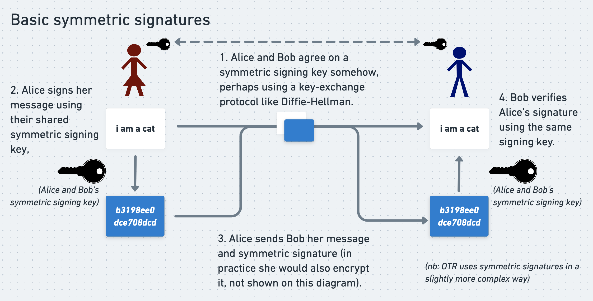

接下来，假设攻击者完全攻破了 Alice 的电脑。他们窃取了一堆 Alice 与 Bob 通过 OTR 交流的消息。攻击者想把消息交给维基解密并让其公布。他们知道维基解密会要求提供密码学证据来证明消息的真实性，因此他们还窃取了这些消息的 HMAC 签名。由于验证 HMAC 签名需要共享的签名密钥，攻击者利用对 Alice 电脑的完全控制权，在 Alice 有机会从内存中清除这些密钥之前，一并窃取了这些密钥。

攻击者找到维基解密，试图用消息的 HMAC 签名来证明他们窃取的消息数据包是真实的。对于每条消息，他们将消息内容和 HMAC 密钥输入 HMAC 算法，向维基解密展示计算出的签名与被窃邮件数据包中的签名一致。对于非对称签名而言，这将是消息合法性的有力证据。

然而，对于对称签名，这什么都证明不了！由于 HMAC 签名是对称的，生成和验证签名使用的是同一个密钥。攻击者为了验证签名，必然需要知道这个密钥，那么他们完全可以轻而易举地用同一个密钥来伪造签名。即使他们的确是通过“正当”手段偷来的，也无法向维基解密证明自己没有伪造。注意，如果维基解密怀疑攻击者可能偷走了 Alice 的私钥并自行伪造了签名，同样的逻辑也适用于非对称签名。

这种防御机制在 Alice 或 Bob 与对方反目、突然想要向全世界曝光他们的 OTR 通信时也同样有效。他们可以公布所有交换过的通信记录、密钥、签名和消息，但无法证明自己没有伪造这些签名。你可能大多时候都信任你的朋友，但使用安全的加密手段以防万一总归是好事。

对称签名与非对称签名场景的关键区别在于，非对称签名的生成和验证使用的是不同的密钥。因此，攻击者可以验证偷来的签名，却无法自行生成这些签名。而在试图用对称签名来验证偷来的消息时，攻击者拥有的能力反而成了他们的“负担”。

### 为什么 OTR 有必要并且可以接受使用非对称签名来签署其中间 Diffie-Hellman 值？

我们一直在喋喋不休地谈论 OTR 使用对称算法和共享密钥对消息进行签名是多么巧妙和重要。这使得 OTR 既能提供身份认证，又能保持可否认性。 Alice 和 Bob 可以确信自己在直接与对方交谈，同时在通信被泄露后也能否认曾经交谈过。

然而，他们能够信任这些对称签名以提供身份认证，唯一的原因是他们相信自己是与正确的人协商出了生成这些签名的共享密钥。如果攻击者能够操纵他们的密钥交换过程，就可能诱使 Alice 在不知情的情况下与攻击者（而非 Bob ）协商出共享密钥。攻击者随后就可以冒充 Bob 与 Alice 交谈。

我们已经花了大量篇幅讨论非对称密码学在可否认性方面的隐患。但在互联网上，如果你要确认自己是在与正确的人交谈，很可能最终还是得用到非对称签名和公钥/私钥对。在 OTR 中，Alice 和 Bob 通过巧妙安排的非对称签名来确保自己与正确的人协商密钥。这些特定的非对称签名究竟有何作用？它们为何是安全的？

正如我们所见，Alice 和 Bob 通过 Diffie-Hellman 密钥交换过程协商出共享的对称加密密钥。随后，他们取这个对称加密密钥的哈希值，将其作为对称签名密钥。重要的是，他们使用非对称签名向对方证明，自己是在与正确的人协商这些密钥。

回顾 Diffie-Hellman 密钥交换过程，双方各自首先生成一个长的随机数。他们不直接发送这些随机数给对方，而是交换从原始随机数推导出的精心选择的“中间值”。借助精妙的数学原理，双方通过将自己的原始随机数与对方的中间值相结合，可以生成同一个共享密钥。同样值得注意的是，即使攻击者拦截了通信并读取了双方的中间值，由于不知道任何一方的原始随机数，也无法构造出共享密钥。

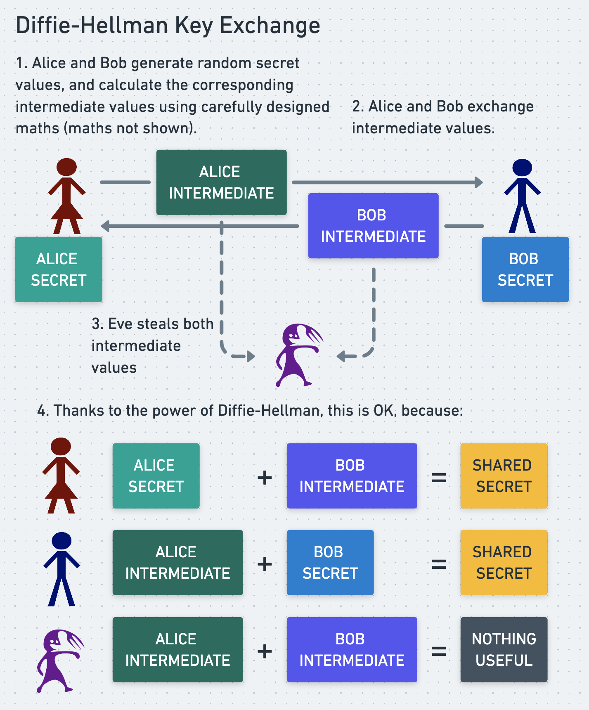

为了让彼此确信自己是在与正确的人进行 Diffie-Hellman 密钥交换，Alice 和 Bob 在发送各自的中间值之前，先用各自的私钥对中间值进行签名。当 Alice 和 Bob 收到对方的中间值时，可以用对方的公钥验证附带的签名。这让她们确信中间值确实是由正确的人生成的，因此她们也是在和正确的人进行密钥交换。这意味着她们可以相信，从密钥交换中派生出的共享密钥只有她们和对方知道，因此任何使用该密钥和对称算法（如 HMAC）加密或签名的消息都是真实的、完好无损的。

用非对称算法和私钥对 Diffie-Hellman 中间值进行签名，能为最终生成的密钥提供良好的认证和信任，同时不会损害参与者的可否认性。如果攻击者截获了密钥交换过程中签名的消息，他们所能证明的只是 Alice 和 Bob 交换了几个随机数。这或许能为攻击者构建一个间接证据，证明 Alice 和 Bob 一直在交换隐蔽消息，但 Alice 和 Bob 的加密方式并不能从数学上证明她们有罪。

OTR 协议通过精心控制签名内容和签名方式，在提供强认证的同时保留了可否认性。

### 为什么发送方要公开共享的 HMAC 签名密钥？

我们已经了解了 OTR 协议如何利用 HMAC 签名实现“可否认的认证”。但是，发送方为什么要在使用完毕后，费尽心思地将共享签名密钥向全世界公开呢？其原因与前面几节中马修·格林呼吁谷歌公开 DKIM 签名密钥的原因类似，但又有着微妙的差别。

在 OTR 协议中，消息签名不需要为所有人、所有时刻提供消息真实性的永久性证明。事实上，为了保持可否认性，理想的 OTR 签名应尽可能少的人、尽可能短的时间期限内证明消息的有效性。

只有接收方需要确信 OTR 消息的签名是有效的，而且也只在最初接收消息并验证签名时需要。一旦接收方用签名验证了消息，他们可以记录该消息是有效的这一事实。他们再也不用再看那个签名，也无需再次信任它。

这意味着，一旦接收方利用签名验证了消息的有效性，我们就希望让这个签名对任何可能窃取它、并想用它来证明（或至少提供证据表明）对应消息是真实的人来说，变得毫无用处。我们希望用完之后就彻底销毁整个系统。

我们已经看到，OTR 签名对攻击者来说已经近乎无用，因为它们是使用对称算法 HMAC 生成的。攻击者永远无法用 HMAC 签名向怀疑的第三方证明窃取到的消息是真实的，因为第三方知道攻击者完全可以轻易伪造这些签名。无论参与者是否公开其签名密钥，攻击者都处于这种困境之中。

然而，攻击者仍然可以利用他们窃取的 HMAC 签名，让自己和信任的同伙更加确信对应消息是真实的。从攻击者的角度看，HMAC 密钥只有 Alice 、 Bob 和攻击者知道。既然攻击者知道自己没有伪造消息，他们就可以确信这些消息是由 Alice 和 Bob 合法撰写和签名的，尽管他们无法向其他人证明这一点。如果攻击者有完全信任他们的同伙，那么这些同伙也可以同样确信消息的真实性。例如，法庭可能会信任某个情报机构不会伪造 HMAC 签名（尽管他们有能力伪造），从而将签名作为消息真实性的有力证据。

然而，通过公开他们临时的 HMAC 签名密钥，Alice 和 Bob 使得攻击者更难确信自己截获的消息是真实的。如果任何人都能看到他们的临时 HMAC 签名密钥，那么任何人都可以撰写、签名这些消息并将其偷偷塞进 Bob 的硬盘。诚然，这些消息出现在那里的最合理解释仍然是 Alice 和 Bob 撰写并签名了它们，但公开签名密钥仍然是 Alice 和 Bob 引入额外不确定性和可否认性的一种廉价而巧妙的策略。攻击者无法再像以前那样确信他们窃取的消息是真实的，而与攻击者分享这些消息的任何人不仅要像以前一样相信攻击者是诚实的，还要相信这些消息没有被第四方伪造。这不是一个“我是斯巴达克斯”的时刻，更像是“她是斯巴达克斯，或者他是，又或者她是，我不知道，别烦我。”

### OTR 为什么使用可延展性加密算法？

我们已经看到 OTR 签名如何被设计成一旦被攻击者攻破就会化为乌有。然而，即使是未签名的密文，也可能与其作者之间形成难以否认的关联。这些关联不像签名那样具有数学上的不可推翻性，但为了追求完整性，OTR 试图通过使用可延展的、易于篡改的加密算法来切断这些关联。这是如何实现的呢？

可延展性加密算法要解决的问题是：对于大多数加密算法而言，如果不知道加密密钥，就很难生成一个能解密出有意义内容的密文。虽然不是难到可以断定任何能解密出有意义明文的密文必然是由知道密钥的人生成的，但仍然非常困难。这意味着，如果一个密文能解密出有意义的明文，就有理由推断它很可能是由掌握加密密钥的人生成的。即使没有有效的签名，这也能为 Eve 提供强有力的证据，证明消息是由 Alice 或 Bob 发送的。

为了切断这种虽不完整但仍不受欢迎的关联，OTR 使用可延展的流密码进行加密。可延展性加密算法是指，攻击者即使不知道加密密钥，也相对容易生成一个能解密出有意义内容的密文。攻击者通过正确猜测被窃密文所解密出的明文来实现这一点。如果猜测正确，攻击者就可以操纵被窃密文，使其解密出他们选择的任意相同长度的消息。

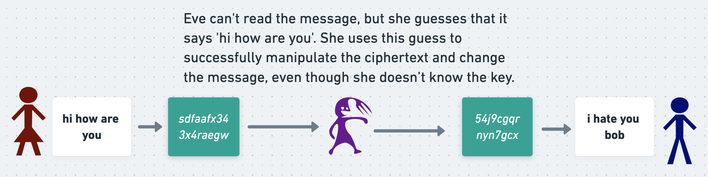

这种“可调整性”为 Alice 和 Bob 提供了额外一层的可否认性，与他们发布HMAC签名密钥时获得的可否认性非常相似。让我们设想一个这种额外可否认性能派上用场的场景。假设 Alice 和 Bob 在Diffie-Hellman密钥交换开始时选择随机秘密值时，意外使用了一个弱随机数生成器。这意味着 Eve 可以通过观察他们的密钥交换流量来推导出他们的随机秘密值。她可以利用这些信息计算出他们的对称加密密钥，并用这些密钥解密 Alice 和 Bob 的消息。这已经是一个很糟糕的结果，但OTR在这种灾难中的目标就是减少损失，让泄露出的消息尽可能具有可否认性。

 Alice 和 Bob 使用对称的HMAC会话密钥签署他们的消息，而不是用他们的私钥。这意味着 Eve 无法用这些签名作为消息真实的证据。但即便 Eve 无法确凿地证明任何事情，她仍然可以试图基于概率权衡来构建一个论证。

她可以指出，Alice 和 Bob 用私钥签署了他们在Diffie-Hellman密钥交换过程中产生的中间值。由于他们使用了弱随机数生成器来生成秘密值，Eve 也就知道了他们的Diffie-Hellman秘密值。她可以利用 Alice 和 Bob 在中间值上的非对称签名，证明他们进行了一次密钥交换，并生成了一个特定的对称会话密钥。 Eve 就可以用这个会话密钥解密 Alice 和 Bob 的消息，并展示解密后得到的是合理的明文。这样她就掌握了具有暗示性的证据，表明 Alice 和 Bob 商定了一个特定的会话密钥，然后交换了可以被该密钥成功解密的消息。

我们之前已经讨论过，即便在没有可延展密码的情况下，这也算不上是可否认性的彻底崩溃。它严格来说只能证明 Alice 和 Bob 交换了两个随机数，而交换随机数并不违法。对称加密的密文——即便是使用不可延展密码加密的——在证明作者身份方面的作用，与对称签名的消息一样无用。如果 Eve 能够解密一个对称加密的密文，那么她也就有能力伪造出这个密文。因此，Eve 无法用 Alice 和 Bob 的密文向其他人证明这些消息是他们写的，因为 Eve 自己也可以制造出这些密文。

然而，与HMAC签名的情况类似，密文能解密出合理的明文这一事实，确实让 Eve 本人非常有信心（也让任何完全信任 Eve 的人同样有信心）相信这些消息是真实的。如果 Eve 知道对称加密密钥只有 Alice 、 Bob 和她自己知道，并且她知道这些密文不是她自己生成的，那么她就能确定这些消息必定是 Alice 或 Bob 发出的。

为了解决HMAC签名中存在的类似问题，Alice 和 Bob 在使用了HMAC签名密钥之后，将其公之于众，以此引入了一些额外的模糊性。这明确表明，任何人都可能生成这些签名，而不仅仅是 Alice 、 Bob 或 Eve 。 Eve 仍然可以假定这些签名很可能是 Alice 或 Bob 生成的，但现在她也不得不考虑这种可能性增加了，尽管增幅很小：这些签名可能来自第四方伪造。

类似地，通过使用可延展密码，Alice 和 Bob 使得以下情况变得更加合理：一个能用他们的对称加密密钥解密出清晰明文的密文，也可能是由第四方生成的，即使这个第四方并不知道该密钥。第四方所需要做的，只是截获他们真实加密消息中的一条，正确猜出其明文版本，并利用所使用流密码的可延展性来生成这条密文。这并非轻而易举，但比起 Alice 和 Bob 使用更稳健的不可延展密码，这要容易得多。

尽管流密码比许多其他类型的密码更容易被篡改，但OTR参与者依靠HMAC签名来保护他们的消息免受秘密篡改。如果一个不知道其加密会话密钥的攻击者篡改了消息（可能是像上文所述那样利用可延展流密码），那么HMAC签名将不再有效，参与者就会意识到自己正遭受攻击。

尽管有这些缓解措施，一旦攻击者发现了他们的加密密钥（从而也就发现了签名密钥），他们的隐私仍然会不可避免地遭到彻底破坏。攻击者将能够伪造消息和签名，直到会话密钥过期。OTR所能做的最好的事情，就是尽快轮换会话密钥，并利用上述所有工具，最大程度地保留可否认性。

### 为什么使用加密密钥的哈希值作为签名密钥？

 Alice 和 Bob 通过Diffie-Hellman密钥交换来商定一个对称加密密钥。他们本可以再进行一次Diffie-Hellman密钥交换来商定一个对称签名密钥，但他们没有这样做。相反，他们计算加密密钥的哈希值，并将其结果作为签名密钥使用。

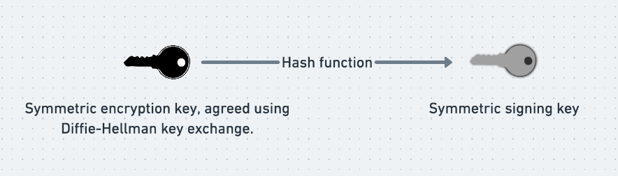

以这种方式将加密密钥和签名密钥关联起来，带来了一个有趣的额外好处。这意味着，攻破了加密会话密钥的攻击者，不管他们愿不愿意，都必然同时攻破了对应的签名密钥——他们只需对窃取的加密密钥进行哈希运算，就能推导出签名密钥。

奇怪的是，这种额外的暴露反而对 Alice 和 Bob 有利。假设攻击者能够攻破对称加密密钥（可能是因为他们在密钥交换中使用了弱的随机数生成器），从而读取消息和签名。由于签名密钥只是加密密钥的哈希值，攻击者必然也会同时攻破签名密钥。这意味着，不可能出现攻击者能够解密消息、却无法为其伪造签名的情况。

这使得攻击者更难窃取消息并向第三方证明其真实性。攻击者或许可以声称自己从未读过Borisov、Goldberg和Brewer在2004年的论文，因此不知道可以利用窃取的加密密钥推导出对应的签名密钥，但如果他们的攻击已经进行到这一步，这种说法恐怕难以令人信服。

### 最大权限原则

你可能听说过“最小权限原则”。这一广泛应用的安全原则指出：

>任何用户、程序或进程，只应拥有执行其功能所必需的最小权限。

对系统应用最小权限原则意味着，攻击者即使攻破了系统的某一部分，也无法轻易横向移动到其他部分或获取更多权限，因此只能造成有限的破坏。这就是间谍以小组形式活动的原因——如果他们被发现并受审，他们所掌握的知识和权限不足以帮助抓捕者顺藤摸瓜摧毁其指挥链。这也是为什么你不应该给公司里的每个人都授予所有系统的管理员权限。即便你毫无保留地信任所有员工，给予用户不必要的权限，也会在他们账户被入侵时无谓地加重后果。攻击者能读取某个人的所有邮件已经很糟糕了；但如果他们能下载所有人的邮件、全部删除，还能伪造出看似来自CEO的消息，那就更糟糕了。

然而，我认为OTR特意反其道而行之，追求的是相反的原则：最大权限原则！最小权限原则的目标是将攻击者攻破系统某一部分后获得的权力降到最低，而最大权限原则的目标则是让攻击者一旦攻破系统某一部分，就能获得对整个系统的全部权力。

要理解这一原则为何对OTR来说反而是一种理想特性，不妨考虑一下OTR不惜一切代价想要防止的最坏情况：攻击者同时具备以下三种能力：

1. 能够获取未加密的消息及其签名
2. 能够向持怀疑态度的第三方证明该签名是有效的
3. 无法自己生成该签名

这三种能力的组合之所以特别致命，是因为它意味着攻击者不仅能读取 Alice 和 Bob 的消息，还能向持怀疑态度的第三方证明这些消息的真实性。关键在于，攻击者能够证明签名有效（第2点），但又无法自己生成该签名（第3点）。这向第三方证明了攻击者并未伪造签名本身。攻击者恰恰从自身有限的能力中获益——这正是最小权限原则的体现，只不过以一种反常的、不利的方式。

正如我们所见，OTR通过使第2点和第3点不可能同时成立，阻止了这三种属性同时出现。如果攻击者能够证明签名有效（第2点），那么他们必然持有该对称HMAC密钥，因此完全有能力自己生成该签名（与第3点相反）。这就是最大权限原则——如果你想要验证签名，那么你也必须能够创建签名，无论你是否想要这种权力。通常情况下，我们希望尽可能地将权限和凭证进行分割；而OTR则是一个反常规的例外。

注：虽然我确实认为“最大权限原则”是审视OTR的一个有用视角，但它并非真正的安全原则，是我自己杜撰的。不必费心去搜索了。

### 结论

我们都希望自己的通信保持秘密，永远不被黑客攻击。不幸的是，有时这种事情还是会发生。任何合理的加密方案，在一切按计划进行时都是安全的。而 OTR 关注的是当情况并非如此时会发生什么。

OTR 提供了加密和认证的标准特性，外加可否认性和前向保密性这些更微妙的特性。如果你的密钥泄露了，Diffie-Hellman 密钥交换能保护你过去的消息安全。如果你的签名被窃取了，对称签名算法意味着攻击者无法利用它们向第三方证明消息的真实性。即使你在密钥交换中使用了较弱的随机数生成器，OTR 也有多层的可否认性机制为你兜底，比如刻意采用可延展性加密算法。

诚然，当我们说你的消息是可否认的、攻击者无法证明是你写的时，我们使用的是“证明”这个词狭义上的数学定义。无论你在辩护时引用多少篇密码学论文，攻击者仍然可能让一家报纸或一个陪审团相信“极有可能就是你写的”。但是，防止你的加密技术反过来对你不利，仍然是有用的。

OTR 将其协议的各条线索编织成一张刻意设计得脆弱的网。签名依赖于加密，加密依赖于密钥交换，利用“最大权限原则”（注意，这不是一个真实的原则），防止攻击者窃取那些他们本无法自行伪造的签名消息。OTR 迫使我们严谨地思考“认证”和“否认”这些词到底意味着什么。向谁认证？在什么时候认证？

我希望 OTR 也能激发你对密码学的想象力，就像当初启发我一样。

