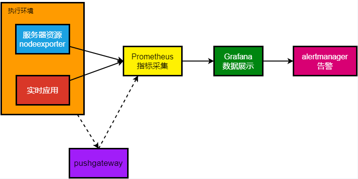

# Grafana + Prometheus 

https://developer.aliyun.com/article/987854

https://juejin.cn/post/6948241754030080037

基本思路是: node_exporter 收集服务器数据，prometheus 从 node_exporter 收集数据，grafana 展示数据。



## 安装 Grafana

https://grafana.com/grafana/download

建议直接 Docker 拉下来

```bash
docker run -d --name=grafana -p 3000:3000 grafana/grafana-enterprise
```
Grafana 会在 3000 端口启动，访问 http://ip:3000/ 即可看到 Grafana 的登录界面。

默认用户名和密码是 admin/admin

## 安装 Node Exporter

https://prometheus.io/download/

https://github.com/prometheus/node_exporter

下载解压，直接运行

```bash
./node_exporter
```

Node Exporter 会在 9100 端口启动，访问 http://ip:9100/metrics 即可看到 Node Exporter 的数据。

## 安装 Prometheus

https://prometheus.io/download/

下载解压之后需要编辑一下配置文件 prometheus.yml

```yaml
# my global config
global:
  scrape_interval: 15s # Set the scrape interval to every 15 seconds. Default is every 1 minute.
  evaluation_interval: 15s # Evaluate rules every 15 seconds. The default is every 1 minute.
  # scrape_timeout is set to the global default (10s).

# Alertmanager configuration
alerting:
  alertmanagers:
    - static_configs:
        - targets:
          # - alertmanager:9093

# Load rules once and periodically evaluate them according to the global 'evaluation_interval'.
rule_files:
  # - "first_rules.yml"
  # - "second_rules.yml"

# A scrape configuration containing exactly one endpoint to scrape:
# Here it's Prometheus itself.
scrape_configs:
  # The job name is added as a label `job=<job_name>` to any timeseries scraped from this config.
  - job_name: "prometheus"
    static_configs:
      - targets: ["localhost:9090"]

  - job_name: 'server'
    static_configs:
      - targets: ['localhost:9100']
```

默认的一般都不用动，主要是两个 job，一个是 prometheus 自己，一个是 server，server 是 node_exporter 的地址。

访问 http://ip:9090/ 即可看到 Prometheus 的界面。

其实 Prometheus 也可以作为监控面板，但是 Grafana 更强大，所以一般都是用 Grafana。

## Grafana 配置 Prometheus 数据源

登录 Grafana，默认管理员是 admin/admin，登陆进去之后记得改密码。

点击左侧的 Configuration -> Data Sources -> Add data source ，选择 Prometheus。

填写 Prometheus 的地址，一般是 http://ip:9090/ ，点击 Save & Test，如果显示 Data source is working 就说明配置成功了。

## Grafana 导入 Dashboard

Grafana 有很多 Dashboard 可以直接导入，点击左侧的 + -> Import ，输入 Dashboard 的 ID，点击 Load，然后选择 Prometheus 数据源，点击 Import 即可。

https://grafana.com/grafana/dashboards/

推荐款：

https://grafana.com/grafana/dashboards/1860-node-exporter-full/

然后即可看到 Dashboard 的数据。

## 配置 systemd 实现开机自启

注意权限，不然拉不起来

记得改为自己配置的用户名和路径

在 `/etc/systemd/system/node_exporter.service`

```shell
sudo vim /etc/systemd/system/node_exporter.service
```

```conf
[Unit]
Description=Node Exporter
After=network.target

[Service]
User=cherrling
ExecStart=/opt/grafana/node_exporter/node_exporter
Restart=on-failure

[Install]
WantedBy=multi-user.target
```

在 `/etc/systemd/system/prometheus.service`

```shell
sudo vim /etc/systemd/system/prometheus.service
```

```conf
[Unit]
Description=Prometheus
Wants=network-online.target
After=network-online.target

[Service]
User=cherrling
WorkingDirectory=/opt/grafana/prometheus
# ExecStart=/opt/grafana/prometheus/prometheus --config.file=/opt/grafana/prometheus/prometheus.yml --storage.tsdb.path=/opt/grafana/prometheus/data
ExecStart=/opt/grafana/prometheus/prometheus 
Restart=on-failure

[Install]
WantedBy=multi-user.target
```

重载 systemd

```shell
sudo systemctl daemon-reload
```

启动服务

```shell
sudo systemctl start node_exporter
sudo systemctl start prometheus
```

开机自启

```shell
sudo systemctl enable node_exporter
sudo systemctl enable prometheus
```

检查服务状态

```shell
sudo systemctl status node_exporter
sudo systemctl status prometheus
```
