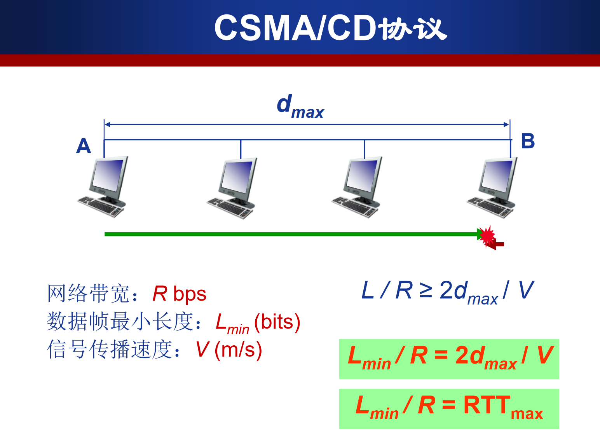
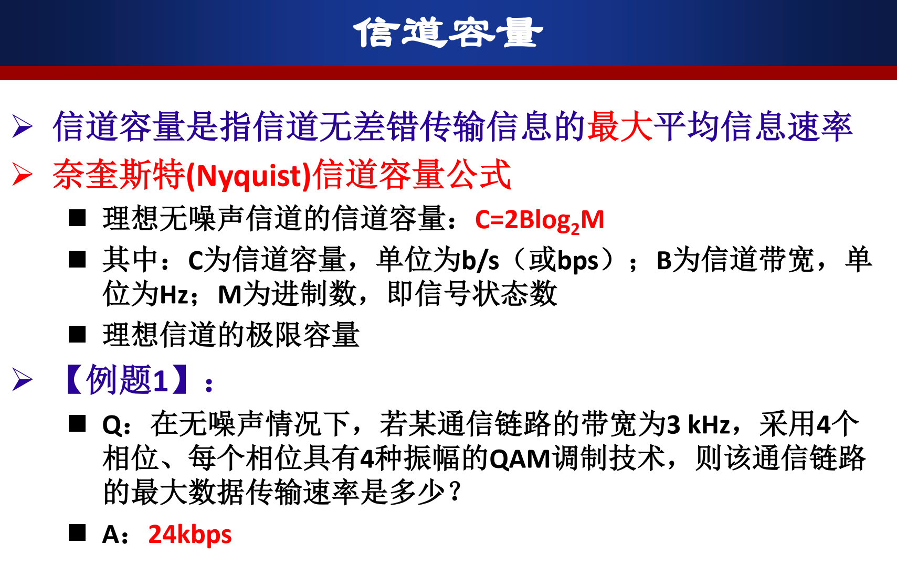
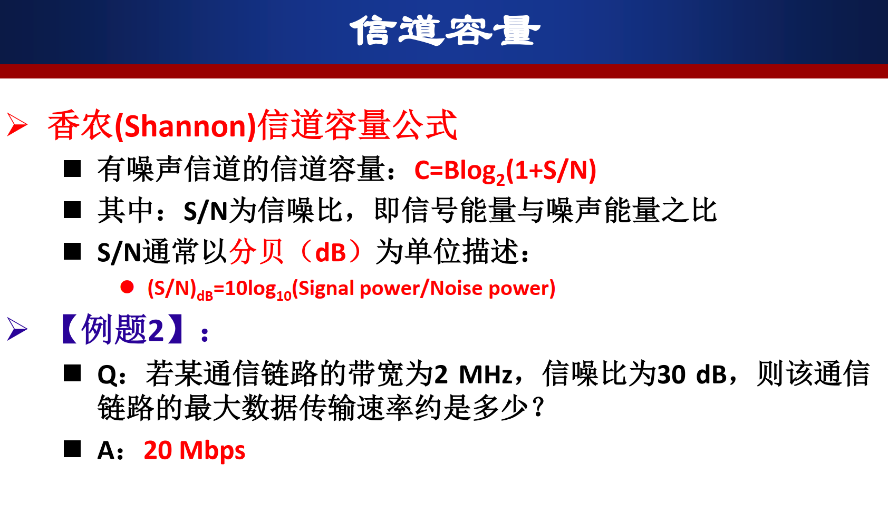

## CSMA/CD协议

## 信道容量

10Mbps的以太网采用曼彻斯特码

IEEE806.5令牌环网采用差分曼彻斯特码

快速以太网（100BASE-TX和100BASE-FX）传输码采用的是4B5B编码

* 这样只需从25=32个码中优化选择24=16个码， 以便保证足够的同步信息， 并且可以利用剩余的16个禁用码进行差错检测

## 子网号为何不能为全0或全1

https://www.cnblogs.com/jmhwsrr/p/14021035.html

1. 子网号为何不能为全0或全1？

今天在写计算机网络-网络层的作业时遇到了一个问题：

问题：试找出可以产生一下2个A类子网的子网掩码。

题目很简单，A类网络的子网掩码为`255.0.0.0`，如果需要在A类网络下划分两个子网，除去全1与全0，子网掩码为`255.192.0.0`。

但对于为什么要剔除全0或全1却有些模糊不清。遂与同学交流讨论，翻阅博客，最终找到了答案。

拿`45.0.0.0`这个A类地址来举例，设其子网掩码为`255.192.0.0`。

全0的情况：

在子网号全为0时，其网络号为`45.0.0.0/10`。显然，在路由器眼中，其与`45.0.0.0/8`并无区别，产生二义性。

全1的情况：

在子网号全为1时，若想对本子网(`45.11.0.0/10`)广播，其目的ip应为`45.255.255.255`。然而，这却与`45.0.0.0/8`的广播产生了冲突，不能确定应该对子网还是对整个网段进行广播，产生二义性。

## CIDR子网号为何能为全0或全1？

因为在无分类的情况下，采用最长前缀匹配来进行路由转发，掩码与ip地址总是成对出现，所以不存在二义性的问题。

