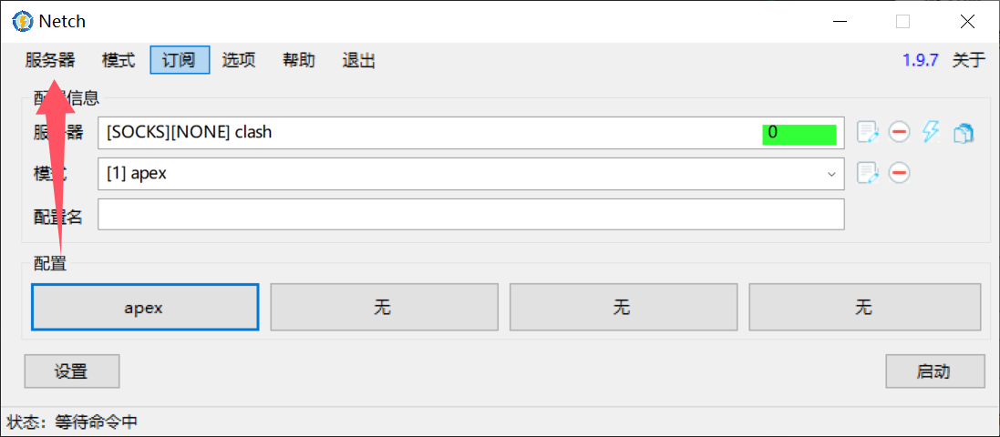
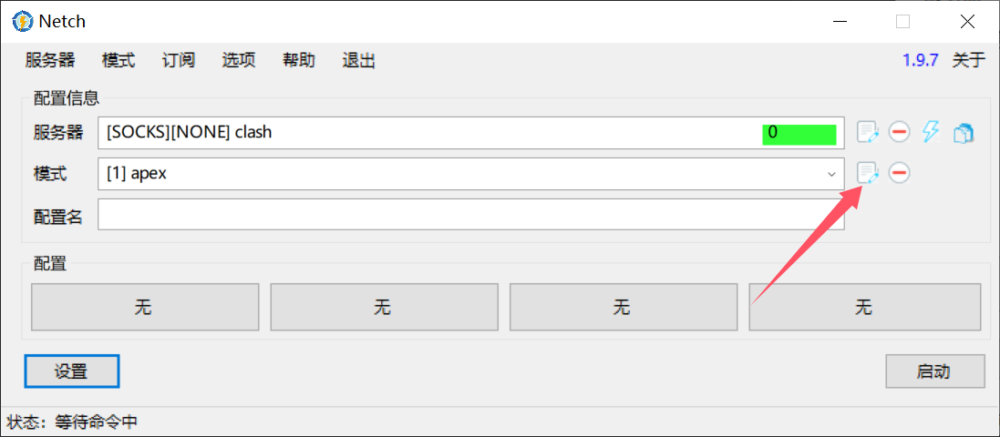
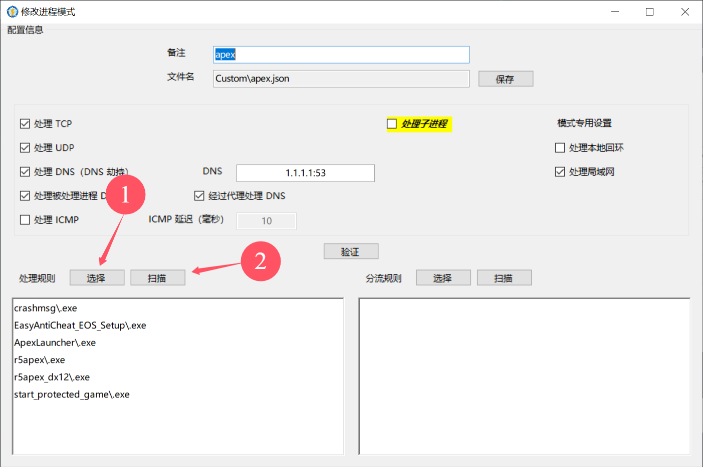
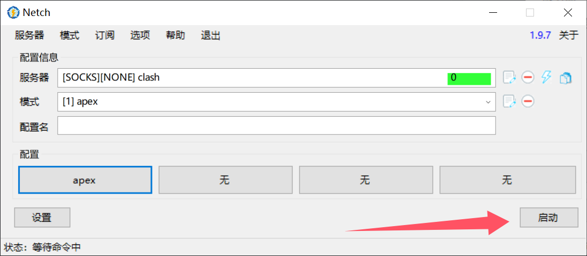
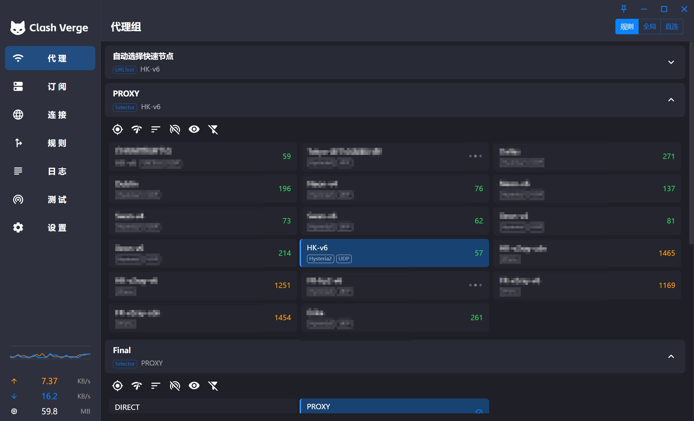

# 使用 Netch + Clash 自建加速器

>In preparation for 2.0, this repository will be cleared of all 1.0 related releases and code

https://github.com/netchx/netch

https://wiki.kache.moe/2019/11/20/Windows-Netch/

本质上就是使用 Netch 劫持指定游戏客户端的流量，然后通过 Clash 代理转发到指定的服务器。

因为 Clash 代理这条线路是自己搭的或者机场提供的优选线路，线路质量和丢包控制都比较好，所以可以实现加速效果。

## Netch 设置

左上角 `服务器` 添加 Clash 的 Socket5 代理地址和端口。

然后添加一个模式

先去选择要加速的游戏客户端目录，然后扫描到 exe 文件

然后启动 Netch

这样当指定的游戏启动时，Netch 会自动劫持流量，然后转发至 Clash 代理。

::: danger

要先启动 Clash 和 Netch，然后再启动游戏客户端。

不然 Netch 无法劫持到流量。

:::

## Clash 设置

在 Clash 中选择你要加速的游戏区服即可

比如在这里我选择一个延迟比较低的香港节点

游戏内的加速效果：

