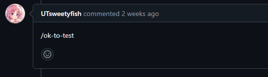
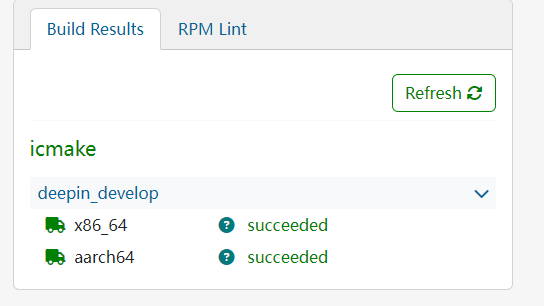
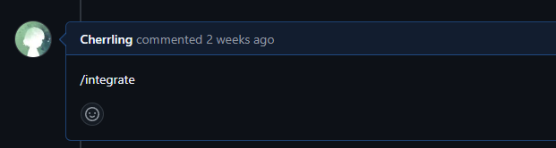
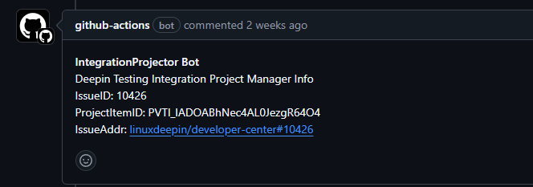
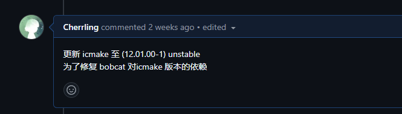

# 第一个pr：工作流程概述

***感谢bcc在技术上的大力支持，没有bc神就不会存在这篇文章***


如果你成功通过了 pre-task，与 plct 签订了契约，那么恭喜你，此时你已经算是一个正式的实习生了。
接下来 mentor 或者 HR 会大概给你讲一下在 plct 按产出数量计费的工资规则，然后……就没了？

是的，至少在撰写此文的 2024.08，`J128-甲辰计划的 deepin 联合实习生`岗位还没有比较傻瓜式的实习生入门指南。
如果你是没有太多“大公司”实习经历的普通鼠鼠，仅仅用过 git 做过简单的，3-5人内的小范围协作的话，该岗位复杂的工作流程很容易搞得你一头雾水。
因为在官方文档的协作流程指南中并没有一套较好的示例。此时比较好的方法是直接摇人，找一个有些资历的实习生问一问学一学。
或者你可以完整阅读此文，笔者将手把手教你如何在 plct 做出自己的第一份贡献~~（第一笔钱）~~。

本文以手动升级 icmake 软件包为完整示例，讲解向 plct 下 deepin 实习岗位提交产出的完整流程。
要说明的是笔者目前负责的部分是 deepin risc-v 的修包工作，其他岗位请自行按需修改。

## 1.我要修什么

以 deepin risc-v 岗为例，你可以在[这里](https://build.deepin.com/project/monitor/deepin:Develop:main?defaults=0&failed=1&unresolvable=1&arch_riscv64=1&repo_bootstrap-i386=1&repo_bootstrap-loong64=1&repo_bootstrap-loong64-stage1=1&repo_standard=1)找到当前 OBS 系统中构建失败或出错的软件包

比如先选择了 bobcat 这个包，查看发现 unresolvable 报错原因是 icmake 版本过低（nothing privides icmake >= 9.03.01）。
这表明 deepin 里的仓库目前没有可用的 icmake >= 9.03.01 (编译错误，或版本太低，或根本没有)。
所以我们的目标就是让 icmake >= 9.03.01 在仓库里可用。
然后在列表中同样看到了 icmake 包也有报错，原因是 libbobcat 版本过低（nothing provides libbobcat-dev >= 5.07.00）。

现在大概可以看出，这两个包涉及到了循环依赖的错误。那么该如何解决这个问题呢？
在 debian 官网的包页面 https://tracker.debian.org/pkg/icmake ，可以看到 icmake unstable 版本已经更新到了12。
因为 icmake 实际上不依赖 bobcat，在这个做法下，icmake 可以更新至12.01.00-1。
而 deepin 和 debian 同根同源，两个包不能说是完全一样，但可以说是极其相似且通用。
所以我们可以用 debian 仓库的程序源码来给 deepin 的仓库升级更新软件包版本。

## 2.我该怎么做

在正式开始修包之前，我们还需要安装一些必要的依赖，首先安装 devscripts 
```shell
sudo apt install devscripts
```
然后，我们要按照 debian 的操作指南，定义一个 dquilt 命令：https://www.debian.org/doc/manuals/maint-guide/modify.zh-cn.html
按照网页操作执行 3.1 的步骤即可，这里要注意根据你自己使用的 shell 是 `bash` 还是 `zsh` 来调整编辑 `.bashrc` 还是 `.zshrc`。

一般情况下能在 obs 系统中看到 icmake 这个包，就说明这个仓库已经被创建了： https://github.com/deepin-community/icmake 
把这个仓库 fork 到自己账户下，然后 clone 到本地。这时候进入文件夹就能看到 icmake 包的源码了。

我们手动升级的整个流程就是，使用 debian 仓库测试好的源码覆盖现有的源码，同时要注意保留 deepin 仓库中特有的一些文件，然后尝试 build。
我们需要保留 deepin 仓库中的 `.git` `.github` 和 `debian/deepin`。假如我们将 deepin 仓库的 icmake 拉了下来，存放在 ~/icmake ，比较推荐的操作步骤是：
```shell
cd ~/icmake
mkdir ../preserve
mv .git .github debian/deepin ./preserve
cd ..
```
此时我们相当于把要保存的三个文件夹暂存到了 ~/preserve 。

然后我们要把 debian 仓库的源码拉下来，在 debian 官网的包页面 https://tracker.debian.org/pkg/icmake ，
点进我们想要的12版本，可以看见一个 .dsc 后缀的文件，我们复制他的链接 http://deb.debian.org/debian/pool/main/i/icmake/icmake_12.01.00-1.dsc 。然后执行：

```shell
dget -ux http://deb.debian.org/debian/pool/main/i/icmake/icmake_12.01.00-1.dsc
```
dget 工具会自动帮我们把源码拉下来解压，默认应该在 ~/icmake-12.01.00-1

这时进入 icmake-12.01.00-1 ，查看其中是否有 `.pc` 文件夹。因为有时 debian 会对包做 patch ，而我们的源码应该是未打 patch 的版本，
所以如果有`.pc`文件夹，我们需要执行
```shell
dquilt pop -a 
rm -rf .pc
```
这样我们先前准备的 `dquilt` 指令会自动帮我们解决 patch 的问题，不过也有可能存在 `.pc` 文件夹但是其中没有 patch 的情况，这时就会提示 No patch removed 。
不用管，正常删掉 `.pc` 就可以。

然后我们就可以把刚才准备的三个文件夹塞进这个 debian 的源码包，相当于把这个包变成了 git 库。
```shell
cd ~/icmake-12.01.00-1
mv ../preserve/.git ../preserve/.github ./
mv ../preserve/deepin debian/
```

此时我们就完整执行了抽取 `.git` `.github` `debian/deepin` 然后塞进 debian 源码包里的步骤，这时候可以提交了。推荐先复制一下 debian/changelog 的第一行，然后执行：

```shell
git add .
git commit
```
在弹出的编辑器里粘进去刚才复制的第一行 changelog，在自己稍作修改，写明此次提交将该软件包更新到了什么版本。

这时候就可以`git push`了，然后在 github 把你这次 commit 给 deepin 下面的仓库发 PR ，
同样在标题中注明你这次 PR 干了什么，升级到了什么版本。

## 3.线上 PR 

当你提交了 PR 之后，它大概应该长这个样子：

!> 这个 PR 应该是从你自己刚才 fork 的仓库，请求合并进 deepin 下对应的软件仓库

https://github.com/deepin-community/icmake/pull/4


然后你就可以稍事休息，等待该项目涉及的 maintainer 审阅你的代码，
如果他们觉得你的代码可以去测试打包的话，他们会在下面评论 `/ok-to-test`



需要等差不多十几二十分钟，然后你可以去看一下这个 PR 有没有编译通过，比如在这里：

https://build.deepin.com/package/show/deepin:CI:deepin-community:icmake:PR-4/icmake



编译通过后，至少说明你这个包的代码是没有大问题的，然后你可以申请将这个包集成进 deepin 发行版的仓库中，
你需要在这个 PR 下面的评论区输入 `/integrate`



然后 deepin 相关的 bot 会自动生成相关和 PR 和 issue 

https://github.com/deepin-community/Repository-Integration/pull/1895

然后在这个 PR 里可以找到一个类似这样的链接：

https://github.com/linuxdeepin/developer-center/issues/10426

这就是我们后续需要操作的 issue 



然后你需要在这个 issue 里发一条评论，说明你这次集成请求主要干了什么，比如这样：



然后一段时间内就不需要你操作了，项目主管会指派一个测试人员去测试你这个包跑起来有没有什么问题


需要注意的是，一次一般的合并集成流程会涉及 2 个 PR 和 1 个 issue ，其中第一个 PR 是我们自己提交的，第二个 PR 和 issue 是deepin 的机器人自动生成的。
我们需要操作的是第一个 PR ，在其中发送了`/integrate`申请集成。以及在 issue 里发送我们本次申请继承所涉及的具体内容

如果一切正常，万事顺利，那么这个包就会被合并进 deepin 的软件源内

恭喜你，此时你已经完成了自己在 deepin 实习岗位的第一份有效产出，月末是有钱拿了