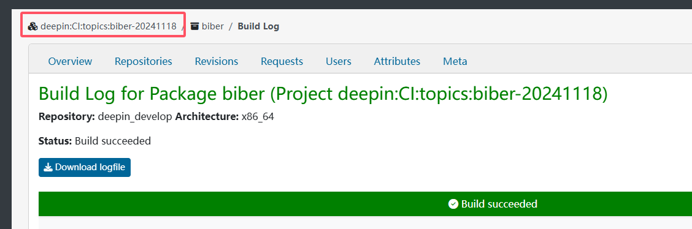
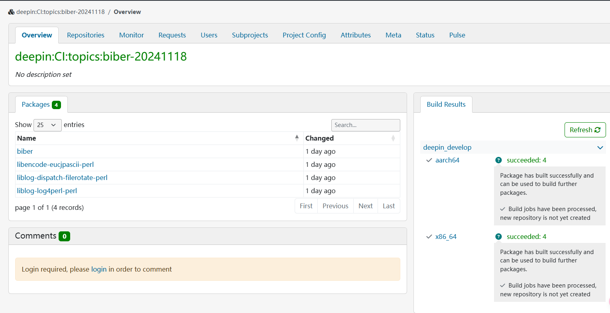
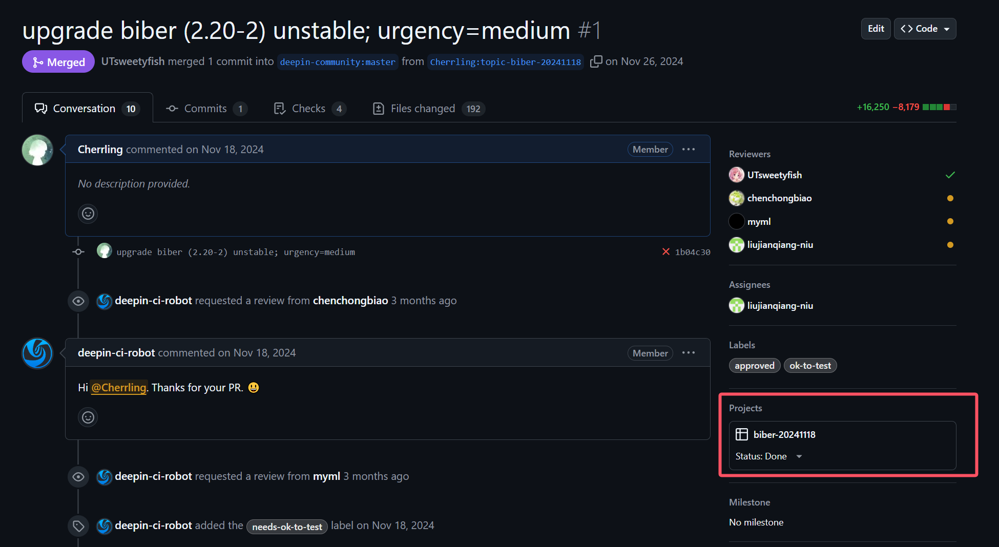

# Topic 工作流程概述

***感谢bcc和🐏在技术上的大力支持，没有bc神和🐏喵喵就不会存在这篇文章***

## 1.为什么要用 topic 打包流

如果你完整的看完了上一篇 `第一个PR：工作流程概述`，并且你很幸运的挑到了一个很简单（没什么坑）的包，那相信你肯定已经成功打包完成了吧!

不过打包的工作肯定不会只停留在如此简单的阶段；很多时候，当你想升级一个包以期望解决某些编译错误时，往往会发现：这 unresolvable 怎么越变越多了？

这是因为当你想要升级一个包时，往往他的依赖包也需要升级，而这些依赖包的依赖包也需要升级，这就形成了一个依赖链。
尤其是当某一系列的陈年老包需要升级时，这个依赖链就会变得很长。而且会变成一棵依赖树。

这时候你可以有两种解决方案，第一种是慢慢溯源找到最底层的依赖包，然后升级它。
因为 obs 系统是使用集成仓库中的包解决依赖的，所以你还需要等所有的底层包构建通过、
打包完成、然后等待测试人员测试通过、合并进继承仓库之后，才能开始构建上一层的包。
如此循环每一层都需要三四天的时间，那整个开发时间就拉的太长了。并且这种方式也很难看出你的包还需要做哪些修改，开发效率大大降低。

那么我们要怎么解决这个问题呢，这就需要我们使用第二种解决方案：deepin 的 topic 打包流。

## 2.什么是 topic 打包流

[官方文档](https://wiki.deepin.org/zh/%E5%BE%85%E5%88%86%E7%B1%BB/02_%E6%8C%89%E8%BD%AF%E4%BB%B6%E5%8A%9F%E8%83%BD%E5%88%92%E5%88%86/02_%E5%BC%80%E5%8F%91%E4%BA%BA%E5%91%98%E5%B8%B8%E7%94%A8%E8%BD%AF%E4%BB%B6%E4%BB%8B%E7%BB%8D/01_%E7%BC%96%E7%A8%8B%E5%BC%80%E5%8F%91/%E7%89%88%E6%9C%AC%E6%8E%A7%E5%88%B6/%E7%9B%B8%E5%85%B3%E5%86%85%E5%AE%B9/topic%E4%BB%93%E5%BA%93%E6%9C%BA%E5%88%B6%E8%AF%B4%E6%98%8E)

>为方便可持续开发集成等需求，启动topic的管理机制，对代码变更进行标签化的分类，可以很方便的选择提交PR时自动构建的产物存放的仓库，方便进行rc（release-candidate）阶段的多源码包相关性项目进行联调测试，简化集成流程，提高集成准确率、自动化率，方便后期的主题相关的代码、软件包仓库的回溯。

大概就是，你可以通过上传代码时，通过指定特殊名字分支的形式，让一些包作为一个整体`topic`来进行打包。

命名规则是： `topic-` + `指定的名字`。一般我们会采用`主包名` + `日期` 或 `主包名` + `版本号` 的形式来命名。

比如我现在要升级 `biber` 这个包，那么分支名就可以是： `topic-biber-20241118`

:::danger

分支名需要严格以 `topic-` 开头，注意这个英文短横线，不然 obs 会无法识别。

:::

## 3.如何使用 topic 打包流

同样使用 `biber` 这个例子，我们首先按照原来的方式，clone 仓库，修改代码。但是不同的是，这次我们要将代码提交到特定的 topic 分支。

```shell
#切出本地分支,若需要使用topic机制需采用topic-开头的形式命名分支
git checkout -b topic-biber-20241118 
```

然后正常推送仓库，如果你不是提前在仓库建好 topic 分支的话，你可能需要 
```shell
git push --set-upstream origin topic-biber-20241118
```

然后提交 PR ，应该长得像这个样子：

https://github.com/deepin-community/biber/pull/1

这时候如果你进入对应的 obs 构建页面，你会发现导航栏变成了 topic：

https://build.deepin.com/project/show/deepin:CI:topics:biber-20241118



这时候如果有依赖版本不够(这也是我们使用 topic 流的原因)，那就可以开始以同样的操作升级依赖包了，
不过要注意的是，依赖包的 topic 分支名要和你前面使用的 topic 分支名一致，比如都使用`topic-biber-20241118`，这样 obs 才能正确的解析依赖关系。

比如我这里涉及到了三个依赖包：

https://github.com/deepin-community/liblog-log4perl-perl/pull/2

https://github.com/deepin-community/liblog-dispatch-filerotate-perl/pull/2

https://github.com/deepin-community/libencode-eucjpascii-perl/pull/1

此时你就可以到 obs 的 topic 构建页面查看构建状态，等待所有的包构建通过，然后你就可以将这个 topic 集成进 deepin 发行版的仓库中。

https://build.deepin.com/project/show/deepin:CI:topics:biber-20241118

   

## 4. /topic 的使用

如果因为一些奇妙的原因，想将没有使用 topic 的分支提交进某一个 topic，
那么你可以在 PR 里输入 `/topic` + `你的 topic 名称`，比如 `/topic biber-20241118`。

这个命令会将当前的 PR 合并进指定 topic 的 Project 中。你可以在 Github 页面的右侧看到这个 Project。



但是因为一些奇妙的 workflow 适配，目前通过这个方法加入 topic 的包不会被 obs 测试流程拉进 topic 构建，
那既然如此，这指令存在的作用是什么呢？

:::tip

对于一些比较零散的 PR，如果他们能分别独立的构建通过，集成阶段就会产生巨大量的 issue，这是对测试和维护人员的一种精神攻击。

所以我们可以通过 `/topic` 将这些 PR 合并进一个 topic，然后一次性构建，减少集成时 issue 的数量。以便于更好的测试和更快的集成。

:::

## 5.Topic 的集成

和正常的集成输入 `/integrate` 不同，这次你需要输入 `/integr-topic` + `你的 topic 名称`，比如 `/integr-topic biber-20241118`。

:::danger

注意不是分支名称 `topic-biber-20241118`，而是 `biber-20241118`。

:::


然后就是正常的集成流程，触发构建通过后在 issue 里描述这次 topic 的内容，等待测试人员测试通过，然后就可以合并进 deepin 的软件源内了。

:::warning

需要注意的是，`/integr-topic` 实际上是从这个 topic 的 Project 中拉取所有的 PR，然后进行集成。这样可以保证通过 `/topic xxxx` 加入的 PR 也能被集成。

:::