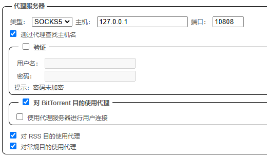
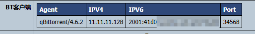
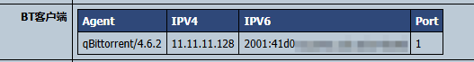
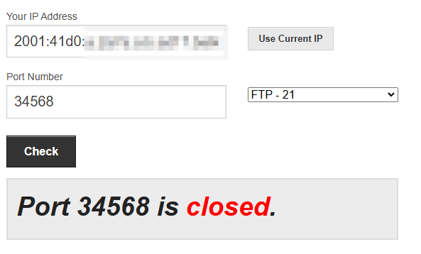
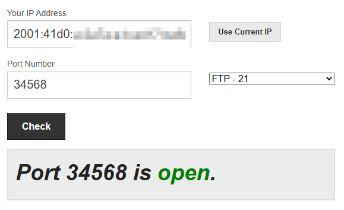
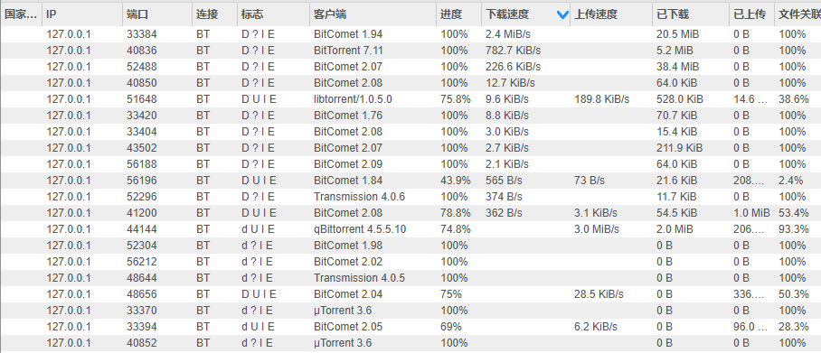

# qBittorrent反代解决NAT连通性

https://bgm.tv/m/topic/group/373306

## 问题根源

国内网络环境大多都是内网，BT方面的软件很多都是P2P的，所以在下载的时候会遇到NAT连通性问题。

为什么会有NAT连通性问题呢？因为在P2P网络中，每个节点都是对等的，所以在下载的时候，你的客户端需要和其他节点建立连接，
而这个连接是双向的，也就是说，你的客户端需要主动连接到其他节点，同时其他节点也需要主动连接到你的客户端。

如果你的客户端在 NAT 后，那么其他节点就无法直接连接到你的客户端，这样就会导致下载速度很慢，甚至无法下载。

如果你的客户端具有公网 IP，那么其他节点就可以直接连接到你的客户端。

也就是说，如果你有公网 IP，相当于你有两个下载的机会：一个是你主动连接到其他节点，另一个是其他节点主动连接到你。

而如果你在 NAT 后，那么你只有一个下载的机会：只能主动连接到其他节点，而其他节点无法主动连接到你。

很多时候的情况是，遇到某一个想下的种子，也能连接到tracker，但是另外几个做种的节点都在 NAT 后，无法直接对他们发起连接。
同时自己也没有公网 IP，上报给 tracker 的 IP 是 NAT 后的 IP，所以其他节点也无法直接连接到自己。

## 问题分析

先说结论：反代，但是这里有很多坑。

我常用的客户端的 qBittorrent，而实际上 qBittorrent 本身就具有代理的支持，然后问题就出在这里了：



首先来看 `通过代理查找主机名` 这一条，这个选项是用来控制 qBittorrent 是否使用代理来连接 tracker 的，
这实际上是最常用的代理设置，因为绝大多数人遇到的问题都是 tracker 被封了，所以需要通过代理来连接 tracker。

然后再来看 `对 BitTorrent 目的使用代理` 这一条，这个选项是用来控制 qBittorrent 上报给 tracker 的 IP 是否是代理的 IP。
但是这里会涉及到另一个问题，这时你上报给 tracker 的端口是你本地的客户端正在监听的端口，而 IP 是代理服务器的 IP。

不过此时你连接其他人的流量还是直连，不会走设置好的代理，可以通过代理服务器的网卡流速来验证。
```
│I/F Name Recv=KB/s Trans=KB/s packin packout insize outsize Peak->Recv Trans    
│      lo      0.0       0.0       0.0    0.0     0.0    0.0       23.1     23.1 
│    eth0      0.8       0.4       8.5    0.5    94.3  878.0      243.4   2792.5 
│    eth1      0.0       0.0       0.0    0.0     0.0    0.0     2618.6     36.9 
│     wg0      0.0       0.0       0.0    0.0     0.0    0.0        0.0      0.1 
│tailscale     0.0       0.0       0.0    0.0     0.0    0.0       19.3     12.7 
```

但是实际上代理服务器的该端口没有监听任何东西，导致其他人也无法连接到你。

使用某 PT 站充当端口检测器：



此时可以在代理服务器的该端口开一个反代，将 vps 该端口的流量映射回本地客户端的监听端口。

你甚至可以将这个反代的隧道也包裹在代理之中，比如利用 hysteria2 来对抗恶劣的网络环境：
https://github.com/apernet/hysteria/issues/558 （注意到这是v1版本配置文件的写法，现在v2版本请参考下文）

还有一个选项是`使用代理服务器进行用户连接`，如果你开启了此选项，qbittorrent 会使用代理服务器来连接其他用户，
也就是说此时你的客户端会通过代理服务器来主动连接其他用户，所有的流量都会经由 vps。

```
│I/F Name Recv=KB/s Trans=KB/s packin packout insize outsize Peak->Recv Trans    
│      lo      0.0       0.0       0.0    0.0     0.0    0.0       23.1     23.1 
│    eth0    135.9     272.9     167.4  320.4   831.0  872.2      243.4  10238.5 
│    eth1    125.0       5.5      71.0   77.5  1803.6   73.3     9599.6     87.6 
│     wg0      0.0       0.0       0.0    0.0     0.0    0.0        0.0      0.1 
│tailscale     0.0       0.0       0.0    0.0     0.0    0.0       19.3     12.7 
```

这种方法通常用于隐藏自己的 IP 地址，避免因为版权问题而被查水表，或者给安全隐私的狂热爱好者使用。

但是这种方法也会遇到一个问题，就是 你会发现 qbittorrent 上报给 tracker 的端口变成了 1。



根本原因是 http 或 socks 代理不支持远程 bind+listen（实际上 socks 的 RFC 中有 bind 指令，但是几乎没有软件实现），
因此你无法通过代理功能实现使用代理来做种，主动连接别的 Peer 可以。QB 的内核 libtorrent 的做法是当你设置http 或 socks 代理，
并且设置`使用代理服务器进行用户连接`后，认为你无法做种，直接向 tracker 发送你的端口为 1 以避免 Peer 尝试连接。

这实际上是我们最不想看到的情况，因为本身我们要解决的问题就是别人无法连接到我们，这端口上报为 1 就更没法搞了。所以如果你想要使用代理来做种，或者是使别人能主动连接到你，***不要开启这个选项***。

那如果你不想暴露自己的真实 IP，想通过代理来进行流量传输。同时你又想要别人能连接到你，这样你可以下载那些做种情况不佳的种子，应该怎么办呢？

## 我要藏起来

解决方法之一是使用 TUN 代理，使用本地的某些代理软件创建虚拟网卡，然后将 qbittorrent 绑定在虚拟网卡上，同时关闭`使用代理服务器进行用户连接`选项。

这时，qbittorrent 所有的流量都会通过代理软件的虚拟网卡，下载的流量就任你操控了，你可以将流量通过代理服务器转发。
同时这时 qbittorrent 不再会上报 1 端口，而是你本地的监听端口。你可以在代理服务器上开一个反向的端口映射隧道，这样别人就可以通过公网 IP 连接到你了。

~~或者，你也可以重写一下libtorrent的源码，然后自己打包一个后端出来~~

通过以上的方案，我们实际上已经解决了 NAT 导致连通性不好的问题，不过如果你对隐藏 IP 没有特别的需求，上述方法其实有点过于麻烦了，
而且还有一个致命的缺点：对于那些有公网 IP 的其他节点，实际上你完全可以直接连接到它们，而不需要通过代理服务器。

如果你经由虚拟网卡代理所有的上下行流量，你对有公网 IP 节点的连接也会消耗你的代理服务器的流量，这是完全没有必要的。即使你购买的是无限流量的 vps，你的上下行速度也会受到代理服务器的限制。

*（但是经笔者测试，国内沟槽的网络环境也会导致你连不上一些有公网 IP 的节点。如果你的代理服务器处于连通性较好的网络环境中，开启代理上下行流量也可以一定程度上增强连接性。）*

所以，如果你只是想解决 NAT 连通性问题，而不需要隐藏 IP，可以查看下面的便宜大碗教程。

## 便宜大碗教程

::: tip
最推荐的方案是：通过 wireguard 和 hysteria2 反代
:::

核心思想在于向 tracker 上报代理服务器的 IP，和本地 qbittorrent 的监听端口（因为qb设定了只能上报自己本地监听的端口，不能自定义），同时不使用代理服务器来连接其他用户。

参数配置：
* 本地 qbittorrent 监听端口：34568
* 代理服务器使用公网 ipv6
* 使用 hysteria2 作为代理隧道
* 开启`通过代理查找主机名`
* 开启`对 BitTorrent 目的使用代理`
* **关闭`使用代理服务器进行用户连接`**
::: info
本文例子中使用 hysteria2 作为代理隧道，因为虽然没有直接使用该代理进行所谓的梯子用途，
但是在防火墙看来，你长期和境外某 IP 进行大流量连接，肯定是要 ban 你的。所以我们还是采用一些可以加密混淆的隧道比较好。
如果你的代理服务器在国内，那么你完全可以使用 ss 这种低加密，甚至是直连，可以在一定程度上提高传输效率和速度。
本文采用 hysteria2 的另一个原因是购买的 vps 线路比较烂，hysteria2 使用的 Brutal 拥塞控制算法可以很大程度上优化传输速度。

https://github.com/apernet/hysteria/issues/558 （注意到这是v1版本配置文件的写法，现在v2版本请参考下文）
:::


在两端设置好 hysteria2 代理后，tracker 接收到的是 vps 的 IP，但此时端口还没转发，所以别人还是无法连接到你。



接下来可以配置端口反代，比如使用ssh：

首先在 VPS 端 /etc/ssh/sshd_config ， 加上下面这条， 然后重启 sshd （一般是执行 `systemctl restart sshd`）。

```yaml
GatewayPorts clientspecified
```
### ssh直连反代
如果你想要直连，可以直接输入：

```shell
ssh -NR :34568:127.0.0.1:34568 root@remoteip 
```
这样 ssh 会将 vps 服务器的端口 34568 映射到本地的 34568 端口上。




需要注意的是，此时要把 qbittorrent 高级设置中的 `允许来自同一 IP 地址的多个连接` 打开，
因为此时通过 vps 隧道连接到你的用户，在 qbittorrent 视角它们都是通过 `127.0.0.1` 连接进来的。

此时即可在 qbittorrent 中看到有 `127.0.0.1`的传入连接，同时也可以在 vps 上看到 qbittorrent 的流量。

```
│I/F Name Recv=KB/s Trans=KB/s packin packout insize outsize Peak->Recv Trans    
│      lo      0.0       0.0       0.0    0.0     0.0    0.0       23.1     23.1 
│    eth0  13947.5   13160.9    6209.4 3471.0  2300.1 3882.7    18896.1  16160.2 
│    eth1      0.0       0.1       0.5    0.5    42.0  146.0     9599.6     87.6  
│     wg0      0.0       0.0       0.0    0.0     0.0    0.0        0.0      0.1 
│tailscale     0.0       0.0       0.0    0.0     0.0    0.0       19.3     12.7 
```



### 通过 hysteria2 的 ssh 反代

在**本地客户端**的 hysteria2 的配置文件中加入：

（因为 hysteria2 只支持从客户端指定端口映射，将对客户端某个端口的方位经由隧道映射到服务器的某个端口）
```yaml
tcpForwarding:
  - listen: 127.0.0.1:6600 
    remote: 127.0.0.1:22
# 这两个都填写 127.0.0.1 ，第一个指的是本地 IP，第二个指的是服务器 IP
```
这会把本地的 6600 端口映射到 vps 的 22 端口上，实现将 ssh 隧道包裹在 hysteria2 之中。

此时的 ssh 指令就会变成：
```shell
ssh -NR :34568:127.0.0.1:6600 root@127.0.0.1 -p 6600
```
整个过程就是，我们在本机向 `6600` 端口发送 ssh 请求，hysteria2 将这个请求通过代理隧道转发到 vps 的 `22` 端口上。
然后启动反向代理，将 vps 的 `34568` 端口通过 vps 的 `22` 端口，再经由 hysteria2 隧道转发到我们本地的 `6600` 端口，最后被 ssh 转发到本地的 `34568` 端口上。

### 通过 hysteria2 的 其他软件反代

这种方式其实和直接使用反代软件差不多，只是多了一层 hysteria2 的隧道，可以用来对抗恶劣的网络环境。

只需要像正常一样使用反代软件如 rathole、frp、gost等，在客户端和服务端安装反代软件后，将连接地址改为经由 hysteria2 隧道的端口即可。

::: info
上面我们之所以使用 ssh 做反向代理，是因为两边的机器肯定都是有 ssh 的，不用额外安装其他的反代软件。
并且 ssh 反代只需要在服务端配置一下 `GatewayPorts clientspecified` 就可以了，连接只需要在客户端发起，服务器不用单独配置 ssh 进程。
:::
### 通过 wireguard 和 hysteria2 反代

这是一种很邪门的方式，配置很麻烦，但是可以在一定程度上提高传输速度和传输效率。

首先考虑我们上面说过的 ssh 反代，有一个问题就是 ssh 的加密解密过程会消耗一定的 CPU 资源，这对于一些性能较差的 vps 来说是一个问题。相比之下，wireguard 所消耗的资源更少。

那为什么一定要引入 wireguard 呢，因为：
1. hysteria2 有一个很致命的问题是，它是 C/S 结构，并且只能在客户端指定端口映射，通过客户端某个端口访问服务端某个端口。这就导致了我们无法直接使用 hysteria2 来做反代。

2. 如果我们把 hysteria2 的隧道倒过来，在本地安装 hysteria2 服务端，然后在 vps 上安装 hysteria2 客户端，又会出现新的问题：vps 上的 hysteria2 客户端是无法连接到本地的 hysteria2 服务端的。

这两个问题只需要解决任意一个即可，所以 wireguard 就是一个很好的解决方案，而且他们俩可以呈现两种组合（即谁包裹谁），分别解决上面的两个问题：


#### 使用 hysteria2 包裹 wireguard

这种方案其实相当于上面的 ssh 反代，只是将 ssh 替换为了 wireguard。

在本地和 vps 上都安装 wireguard，然后本地向 vps 发起 wireguard 连接时使用 hysteria2 隧道转发的端口，这样就可以将 wireguard 的流量包裹在 hysteria2 隧道中。

然后在 vps 端配置一下 iptables 转发，将 vps 的 `34568` 端口的流量通过 wireguard（实际上通过 hysteria2 和 wireguard 两层隧道）转发到本地的 `34568` 端口上。


#### 使用 wireguard 包裹 hysteria2

~~更邪门的一种~~

在本地和 vps 上都安装 wireguard，然后把整个 hysteria2 的隧道倒过来。
如果你同时需要一个正向 hysteria2 代理来连接 tracker 的话，你就需要在本地和 vps 上分别启动两个 hysteria2 实例。

这个倒过来的 hysteria2 隧道即是借由 wireguard 的 IP，让 vps 上运行的 hysteria2 客户端连接到本地的 hysteria2 服务端。

然后直接使用 hysteria2 自带的 tcpForwarding 功能，将vps的 `34568` 端口映射到本地客户端的 `34568` 端口上。

```yaml
# 注意这是配置在 vps 上的 hysteria2 客户端
tcpForwarding:
  - listen: 127.0.0.1:34568
    remote: 127.0.0.1:34568
```


这种方法和上面相比不需要配置 iptables ，但是需要启动两个 hysteria2 实例，而且需要在本地和 vps 上都安装 wireguard。

## 总结

~~本来写着玩的，我也没想到会写这么多内容，其实就是一个 frp 就搞定了的事~~

写了这么多，感觉方法都挺麻烦，可能会有一个问题，这真的值得吗？

难说，如果你真的需要下载一些做种情况不佳的种子，或者是你有一些特殊的需求，比如隐藏 IP，那么这些方法是很值得的。

而且这些东西远没有看起来那么难配置，比如 hysteria2，直接一键脚本就能安好了，而且配置文件也只需要改一两行。

不过伴随着互联网分享精神的日渐式微和国内沟槽的网络环境，可能你做了这些工作也难以找回那些你想要的资源。或者说难以恢复早年间的那种互联网的自由和开放。

***愿 BT 永远不死，愿互联网永远自由。***