# HTTPS与TLS证书链校验

## 密码学

用`非对称加密(RSA)`的手段`传递(AES)密钥`，然后`用(AES)密钥`进行`对称加密传递(AES)`数据。 

https://blog.csdn.net/weixin_45971758/article/details/129359059

https://blog.csdn.net/weixin_43408952/article/details/124727681

### TLS1.2 完整流程图：

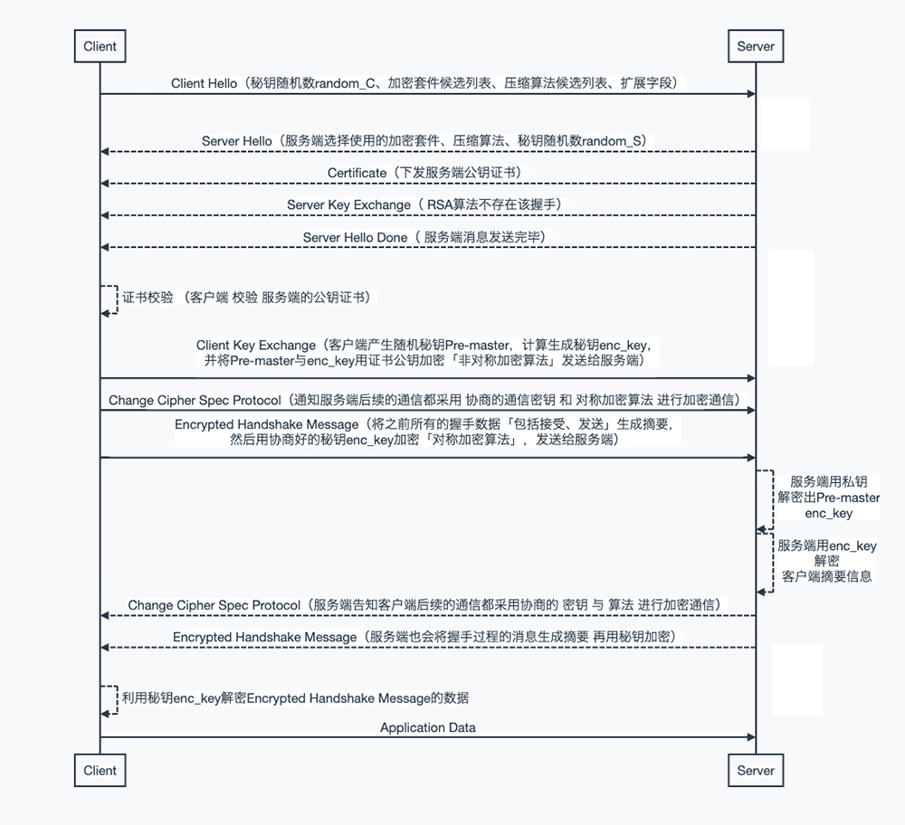
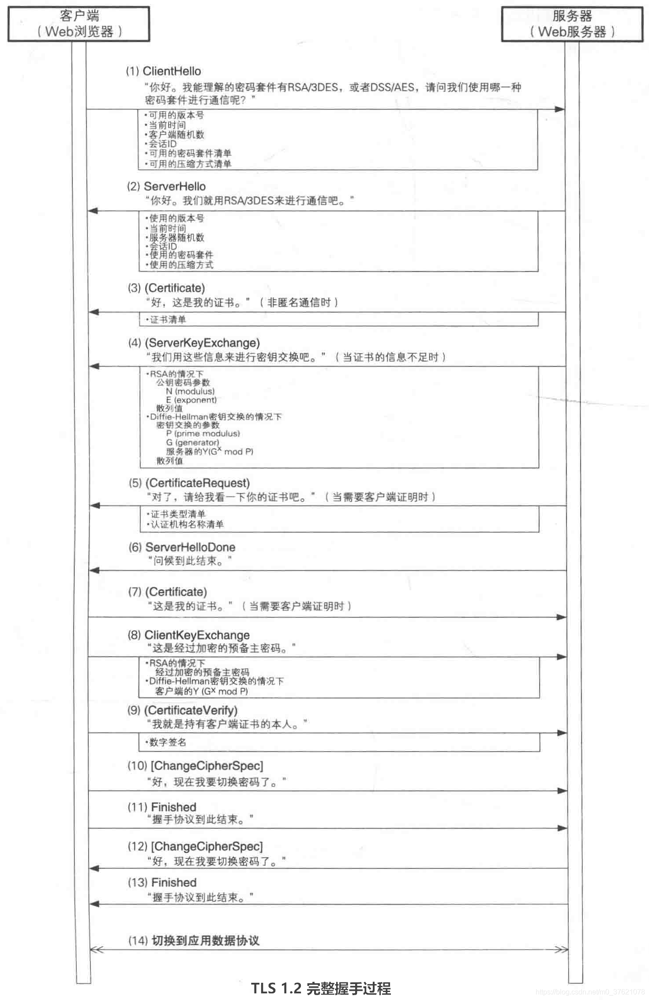
### TLS1.3 的握手流程：

LS 1.3 废弃了RSA密钥交换方案（因为RSA不具有前向保密性），仅支持(EC)DHE密钥协商方案；

RSA密钥交换方案需要客户端先拿到服务器的公钥证书，使用服务器公钥来加密要发送的预备共享密钥，所以RSA密钥交换需要在第二个网络往返中交换共享密钥。
DHE密钥协商方案则没有这个限制，虽然理论上客户端也需要先拿到服务器提供的域参数（比如前篇博文介绍DHE中的G、P两个参数，或者ECDHE中的椭圆曲线类型）才能计算出自己的密钥协商参数（比如DHE中的Gc mod P），但这并非必要条件。客户端可以像发送支持的加密套件列表那样，向服务器发送支持的域参数组合列表（比如椭圆曲线类型列表）及其对应的密钥协商参数，服务器只需要从列表中选择一组确定为双方使用的域参数即可，这样就可以在第一个网络往返中协商共享密钥了。
TLS 1.3 可以在第一个网络往返中完成共享密钥协商和身份认证，在完成共享密钥协商和身份认证后可以直接切换到应用数据协议，所以TLS 1.3 完整握手过程只需要一个网络往返（1-RTT）。

TLS 1.3 完整握手过程图示如下：


从TLS 1.3 的握手过程可以看出；

在第一个网络往返就借助key_share 扩展字段完成了密钥协商，后续的身份认证报文均被协商出的handshake_key 加密处理，整个握手过程的明文信息减少了。为便于理解key_share 扩展字段是如何交换(EC)DHE密钥协商方案的有限域参数组(比如椭圆曲线类型)和对应的密钥协商参数的，下面给出key_share 字段的数据结构：
```
struct {
          NamedGroup group;						//有限域参数组或椭圆曲线类型
          opaque key_exchange<1..2^16-1>;		// 密钥协商参数
      } KeyShareEntry;
 
// 下面每一个名称对应一个确定的椭圆曲线或一组确定的有限域参数，按优先级从高到低排列，由
ClientHello报文的Extension - Supported Groups扩展字段记录这些用于密钥交换的命名组
enum {
 
          /* Elliptic Curve Groups (ECDHE) */
          secp256r1(0x0017), secp384r1(0x0018), secp521r1(0x0019),
          x25519(0x001D), x448(0x001E),
 
          /* Finite Field Groups (DHE) */
          ffdhe2048(0x0100), ffdhe3072(0x0101), ffdhe4096(0x0102),
          ffdhe6144(0x0103), ffdhe8192(0x0104),
 
          /* Reserved Code Points */
          ffdhe_private_use(0x01FC..0x01FF),
          ecdhe_private_use(0xFE00..0xFEFF),
          (0xFFFF)
      } NamedGroup;
```


* 由于取消了密码规格变更协议，服务器在发送完CertificateVerify握手报文后可以直接发送Finished握手结束报文，服务器握手结束后在不需要对客户端进行身份认证时（也即仅对服务器端进行身份认证的情形）可以直接发送应用数据。
* 
* 客户端完成服务器身份认证后向服务器发送自己的身份认证报文，客户端发送完Finished握手结束报文后可以直接向服务器发送应用数据（已对服务器进行过身份认证）。从客户端发送ClientHello握手报文到发送应用数据，中间只经过一次网络往返（1-RTT）。
* 
* TLS 1.3 完整握手过程允许服务器对客户端进行后握手身份认证（Post-Handshake Client Authentication），也即初始握手时先不对客户端进行身份认证，当客户端请求访问某些敏感资源时，才要求客户端进行身份认证。
* 
TLS 1.3握手报文ClientHello与ServeHello在进行密钥协商时并没有进行数字签名，通信双方的身份认证主要靠后续的Certificate与CertificateVerify报文保证，因为CertificateVerify报文是对之前的握手消息（自然包括密钥协商消息）进行签名，身份认证放到后面也不会影响整个握手过程的安全性。把客户端与服务器之间完整握手过程中每个握手报文的作用及传递的主要参数字段展开，如下图所示：


* TLS 1.3 完整握手过程在ClientHello与ServerHello报文中交换了各自的随机数，也协商出了预备共享密钥，使用预备共享密钥生成主共享密钥的方式跟前面介绍的TLS 1.2差不多，但升级了伪随机函数PRF。
* 
* TLS 1.3 使用HKDF(HMAC based Key Derivation Function)生成主共享密钥（TLS 1.2使用的是PRF伪随机函数），相比PRF可以输出安全性更强的新密钥。HKDF包括extract_then_expand的两阶段过程，extract过程增加密钥材料的随机性，在TLS 1.2中使用的密钥派生函数PRF实际上只实现了HKDF的expand部分，并没有经过extract，而直接假设密钥材料的随机性已经符合要求。

## 转载内容

转自[https://blog.csdn.net/liuxiao723846/article/details/127739868](https://blog.csdn.net/liuxiao723846/article/details/127739868)

---

前一段时间在看`X.509证书结构` 与 `TLS证书校验链`相关知识，到今天感觉基本了解清楚，想着写一篇文章记录学习心得。

在实际工作中，涉及到`X.509证书结构`与 `TLS证书校验链`的场景便是 `HTTPS` 网络请求。  
这篇文章从`HTTPS`网络请求开始，详细介绍`HTTPS秘钥协商`的详细流程、`TLS证书`的`校验`流程、`TLS证书链`的`校验`流程。

*   HTTPS  
    HTTPS简介。
*   TLS握手  
    HTTPS秘钥协商流程详细说明。
*   TLS证书 校验
*   TLS证书链 校验

### 一、HTTPS简介

`HTTPS` （Secure Hypertext Transfer Protocol）安全超文本传输协议，是一种通过计算机网络进行安全通信的传输协议。  
`HTTPS` 利用 `SSL/TLS` 来加密数据包，经由 `HTTP` 进行通信。  
其设计的主要目的是，提供对网站服务器的身份认证、保护交换数据的隐私与完整性。


#### TLS/SSL

TLS 与 SSL某种程度上指的是同一个概念：

*   `SSL`（Secure Socket Layer） 1994年由 浏览器开发商`Netscape`（美国网景通信公司） 率先倡导研发，为数据通讯提供安全支持，开发了最初的几个版本SSL 1.0、SSL 2.0、SSL 3.0。
*   `TLS`（Transport LayerSecurity）前身为SSL，1999年从 3.1 开始被 `IETF`（Internet Engineering Task Force，Internet 工程任务组）标准化并改名，发展至今已经有 TLS 1.0、TLS 1.1、TLS 1.2 三个版本。

`SSL3.0`、`TLS1.0`由于存在[安全漏洞](https://so.csdn.net/so/search?q=%E5%AE%89%E5%85%A8%E6%BC%8F%E6%B4%9E&spm=1001.2101.3001.7020)，已经很少被使用到。`TLS 1.3` 因改动会比较大，目前尚处在草案阶段。当前被广泛使用的是是`TLS 1.1`、`TLS 1.2`；

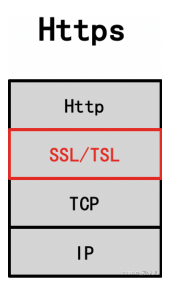
如上图所示，`TLS/SSL`是介于TCP和HTTP之间的一层安全协议。

#### HTTP

`HTTP`（HyperText Transfer Protocol）超文本传输协议。  
`HTTP`是一个客户端（用户）和服务端之间请求和应答的标准，其最初的设计目的是为了提供一种发布和接收HTML页面的方法。

_注：Http协议不是本文重点，感兴趣的同学可参考文章：_  
[HTTP 协议详解：](https://blog.csdn.net/xiaxl/article/details/104541274 "HTTP 协议详解：")  
[一文详解 HTTP 协议\_bjxiaxueliang的博客-CSDN博客\_一文搞懂http协议](https://blog.csdn.net/xiaxl/article/details/104541274 "一文详解 HTTP 协议_bjxiaxueliang的博客-CSDN博客_一文搞懂http协议")

### 二、SSL/TLS 握手

`SSL/TLS`握手过程 用一句话总结就是：用`非对称加密`的手段`传递密钥`，然后`用密钥`进行`对称加密传递`数据。  
`SSL/TLS`握手，秘钥协商的过程大致可分为以下几个步骤：

*   1、Client Hello  
    Client——>Server 客户端向服务端发送 Client Hello 消息。
*   2、Server Hello  
    Server——>Client 服务端向客户端发送 Server Hello 消息。
*   3、Certificate  
    Server——>Client 服务端下发`公钥证书`。
*   4、Server Key Exchange  
    Server——>Client 服务端下发秘钥交换的额外数据。
*   5、Server Hello Done  
    Server——>Client 服务端握手信息发送完毕。
*   6、证书合法性校验  
    Client 对 Server下发的公钥证书进行合法性校验。
*   7、协商加密秘钥  
    Client——>Server 协商计算客户端、服务端通信的`加密秘钥enc_key`。
*   8、Change Cipher Spec Protocol  
    Server——>Client 服务端告知客户端后续的通信都采用协商的`秘钥enc_key`与`算法`进行加密通信。
*   9、Encrypted Handshake Message  
    Server——>Client 服务端用`秘钥enc_key`加密，发出的第一条加密消息。
*   10、Application Data  
    Client——>Server SSL/TLS 握手完成，所有后续通信均 采用`秘钥enc_key`加密。

`SSL/TLS`握手，秘钥协商的流程图 如下图所示：  

这里以`客户端`向`百度主页`发起`Https`请求为例，用 **Wireshark抓包** 对SSL/TLS握手的各个环节进行介绍，抓包示意图如下图所示：  
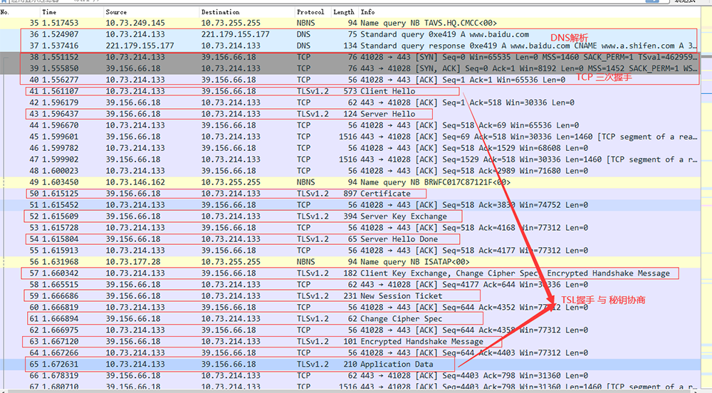
#### 2.1、Client Hello

**Client Hello（ Client——>Server ）：** 客户端向服务端发送 Client Hello 消息。  
消息中包含客户端的 `TSL版本信息`、`秘钥随机数`、`加密套件候选列表`、`压缩算法候选列表`、`扩展字段等信息`，相关信息抓包如下：

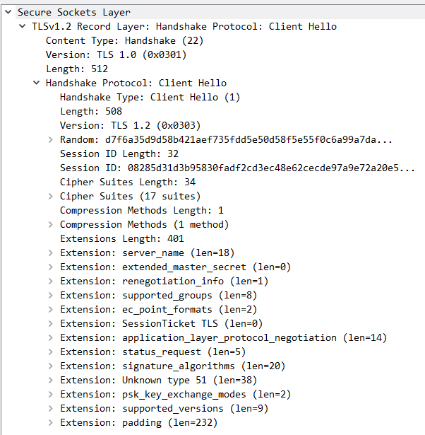

各字段详细描述如下：

*   Version : 支持的最高TSL协议版本，从低到高依次 SSLv2 SSLv3 TLSv1 TLSv1.1 TLSv1.2；
*   Random：随机数 `random_C` 用于后续的密钥协商;
*   Session ID：有或者无，有则客户端传上一次session的id可以恢复session；
*   Cipher Suite：客户端支持的密码算法列表，供服务器选择；
*   Compression Methods：客户端支持的压缩算法列表，用于后续的信息压缩传输；
*   extensions：扩展字段；

#### 2.2、Server Hello

**Server Hello（ Server——>Client ）：** 服务端向客户端发送 Server Hello 消息。  
消息中包括服务端选择使用的`TSL协议版本`、`选择的加密套件`、`选择的压缩算法`、`服务端生成的随机数`等，相关信息抓包如下：

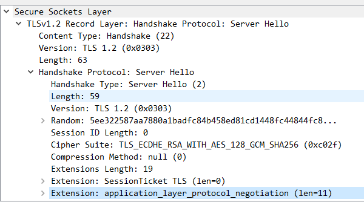

*   Version：服务器选择的版本；
*   Random：随机数 `random_S` 用于后续的密钥协商;
*   Session ID：有或者无，有则客户端传上一次session的id可以恢复session；
*   Cipher Suite：服务端选择的密钥算法；
*   Compression Methods：服务端选择的压缩算法；

_注：到此 客户端 和 服务端 都拥有了两个随机数（random\_C+ random\_S），这两个随机数会在后续生成对称秘钥时会用到。_

#### 2.3、Certificate

**Certificate（ Server——>Client ）：** 服务端下发`公钥证书`给客户端。相关信息抓包如下：


*   `Certificate:` 服务端的公钥证书；

_注：Certificate 公钥证书的详细结构会在下文进行详细举例说明。_

#### 2.4、Server Key Exchange

**Server Key Exchange（ Server——>Client ）:** 该消息的目的是 携带`密钥交换`的`额外数据`。

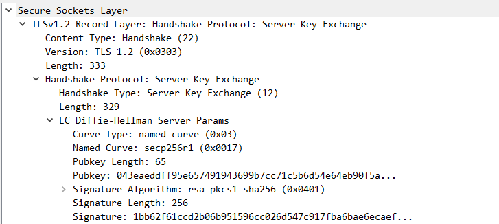

该消息内容对于不同的协商算法套件会存在差异：

*   对于使用DHE/ECDHE非对称密钥协商算法的SSL握手，服务器发送其使用的DH参数；
*   RSA算法不会继续该握手流程（DH、ECDH也不会发送server key exchange）。

#### 2.5、Server Hello Done

**Server Hello Done（ Server——>Client ）:**  
通知`客户端`，Server端已经将所有握手消息发送完毕。


#### 2.6、证书校验

客户端拿到`服务端`的`公钥证书`后，需对该证书的合法性进行校验。校验内容如下：

*   证书链的可信性；
*   证书是否吊销；
*   证书有效期；
*   证书域名校验，核查证书域名是否与当前的访问域名匹配;

_注：证书的详细校验过程将在下文进行详细介绍_

#### 2.7、协商加密秘钥

**Client——>Server：** 这一步包含三个步骤，主要是 协商计算客户端、服务端通信的加密秘钥。


*   Client Key Exchange  
    证书合法性验证通过之后，客户端产生随机数字`Pre-master`。  
    计算生成秘钥`enc_key` { enc\_key=Fuc(random\_C, random_S, Pre-Master) } 。  
    将`Pre-master`与`enc_key`用`证书公钥加密`（非对称加密算法）发送给服务端;
*   Change Cipher Spec Protocol  
    `客户端`通知`服务端`后续的通信都采用协商的`密钥enc_key`和`加密算法`进行加密通信;
*   Encrypted Handshake Message  
    客户端：客户端将之前`所有的握手数据`（包括接受、发送）生成摘要；然后用`秘钥enc_key`加密（对称加密算法），发送给对应的服务端。  
    服务端：服务端收到消息后，会用`秘钥enc_key`解密`客户端的摘要信息`；然后用与客户端相同的算法生成`服务端摘要信息`，最后对比两个摘要信息相同，则验证通过。

#### 2.8、Change Cipher Spec Protocol

**Change Cipher Spec Protocol（ Server——>Client ）:** 服务器同样发送 Change Cipher Spec Protocol 以告知客户端后续的通信都采用协商的`秘钥enc_key`与`算法`进行加密通信;


#### 2.9、Encrypted Handshake Message

**Encrypted Handshake Message（ Server——>Client ）：**  
服务端：服务端会将握手过程的消息生成摘要再用`秘钥enc_key`加密，这是服务端发出的第一条加密消息;  
客户端：客户端接收后会用`秘钥enc_key`解密，能解出来说明协商的秘钥是一致的。


#### 2.10、Application Data （ Client——>Server ）

**Application Data Client——>Server ）：** 双方已安全地协商出了同一份`秘钥enc_key`，所有的应用层数据都会用这个秘钥加密后再通过 TCP 进行可靠传输。


#### 2.11 总结

SSL/TLS握手协商：用`非对称加密`的手段`传递密钥`，然后`用密钥`进行`对称加密传递`数据。

### 三、证书校验

这一节对前文 `2.6证书校验`提到的证书校验流程进行详细介绍：

*   1、X.509数字证书结构举例
*   2、客户端 如何校验服务端下发的公钥证书？

#### 3.1、X.509数字证书

了解证书校验原理之前，先认识一下X.509证书的结构。

`X.509`是密码学里`公钥证书`的`格式标准`，当前`X.509`证书已应用在包括`TLS/SSL`在内的众多网络协议里。  
一个具体的X.509 v3数字证书结构大致如下 :
```
// X.509数字证书
Certificate
  // 版本号
  Version Number 
  // 序列号
  Serial Number 
  // 证书签名算法ID
  Signature Algorithm ID
  // 证书发行者
  Issuer Name
  // 证书有效时间
  Validity period
  // 证书主体名称
  Subject name
  // 证书主体公钥信息
  Subject Public Key Info
    // 证书公钥算法
    Public Key Algorithm
    // 证书公钥
    Subject Public Key
  // 发行商唯一ID
  Issuer Unique Identifier (optional)
  // 主体唯一ID
  Subject Unique Identifier (optional)
  // 扩展
  Extensions (optional)
 
// 证书签名算法
Certificate Signature Algorithm
// 证书签名值
Certificate Signature

```
这里以`百度`的`Tls证书`进行举例：  
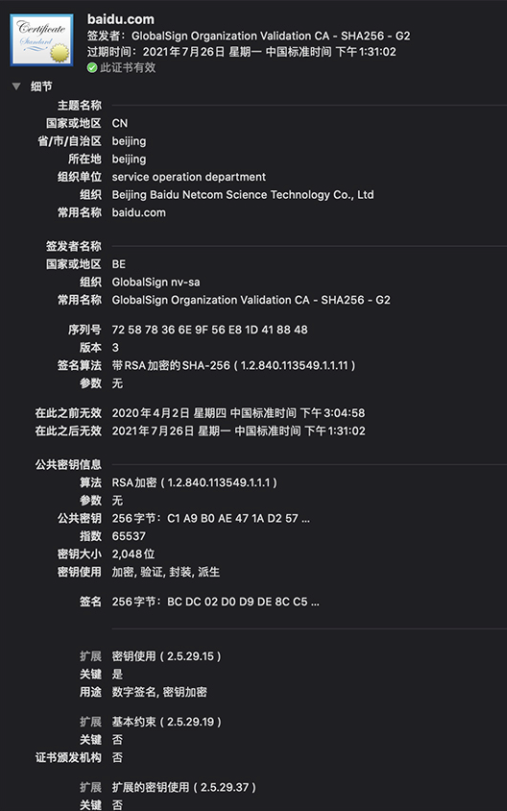
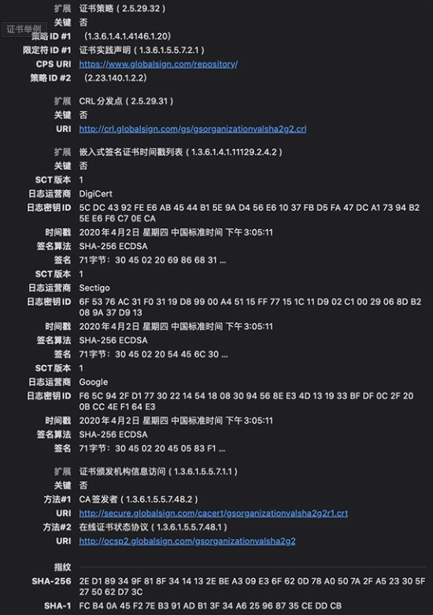

```
Certificate:
	Data:
	    Version: 3 (0x2)
	    Serial Number:
	        72:58:78:36:6e:9f:56:e8:1d:41:88:48
	Signature Algorithm: sha256WithRSAEncryption
	    Issuer: C=BE, O=GlobalSign nv-sa, CN=GlobalSign Organization Validation CA - SHA256 - G2
	    Validity
	        Not Before: Apr  2 07:04:58 2020 GMT
	        Not After : Jul 26 05:31:02 2021 GMT
	    Subject: C=CN, ST=beijing, L=beijing, OU=service operation department, O=Beijing Baidu Netcom Science Technology Co., Ltd, CN=baidu.com
	    Subject Public Key Info:
	        Public Key Algorithm: rsaEncryption
	            Public-Key: (2048 bit)
	            Modulus:
	                00:c1:a9:b0:ae:47:1a:d2:57:eb:1d:15:1f:6e:5c:
	                b2:e4:f8:0b:20:db:ea:00:df:29:ff:a4:6b:89:26:
	                4b:9f:23:2f:ec:57:b0:8a:b8:46:40:2a:7e:bc:dc:
	                5a:45:97:4f:ad:41:0e:bc:20:86:4b:0c:5d:55:21:
	                47:e2:31:3c:57:a7:ec:99:47:eb:47:0d:72:d7:c8:
	                16:54:75:ef:d3:45:11:0f:4b:ce:60:7a:46:5c:28:
	                74:ae:8e:1b:be:d8:70:66:7b:a8:93:49:28:d2:a3:
	                76:94:55:de:7c:27:f2:0f:f7:98:0c:ad:86:da:c6:
	                ae:fd:9f:f0:d9:81:32:9a:97:e3:21:ee:04:92:96:
	                e4:78:11:e5:c4:10:0e:10:31:7a:4a:97:a0:eb:c7:
	                9b:c4:da:89:37:a9:c3:37:d7:56:b1:7f:52:c7:d9:
	                26:0a:d6:af:38:16:b1:6d:fb:73:79:b1:68:79:03:
	                90:eb:88:7b:8c:48:91:98:51:a5:07:94:86:a5:78:
	                46:79:8f:58:9b:e9:35:59:a7:f1:7b:57:31:0a:90:
	                cf:24:ce:0d:24:e7:92:b2:6a:e9:e6:96:37:0a:b8:
	                7c:87:2f:74:d2:5c:e8:4b:0a:5f:66:18:a7:41:86:
	                cf:26:a6:08:8e:a5:49:17:92:53:b3:91:a5:cf:53:
	                b0:31
	            Exponent: 65537 (0x10001)
	    X509v3 extensions:
	        X509v3 Key Usage: critical
	            Digital Signature, Key Encipherment
	        Authority Information Access: 
	            CA Issuers - URI:http://secure.globalsign.com/cacert/gsorganizationvalsha2g2r1.crt
	            OCSP - URI:http://ocsp2.globalsign.com/gsorganizationvalsha2g2
 
	        X509v3 Certificate Policies: 
	            Policy: 1.3.6.1.4.1.4146.1.20
	              CPS: https://www.globalsign.com/repository/
	            Policy: 2.23.140.1.2.2
 
	        X509v3 Basic Constraints: 
	            CA:FALSE
	        X509v3 CRL Distribution Points: 
 
	            Full Name:
	              URI:http://crl.globalsign.com/gs/gsorganizationvalsha2g2.crl
 
	        X509v3 Subject Alternative Name: 
	            DNS:baidu.com, DNS:baifubao.com, DNS:www.baidu.cn, DNS:www.baidu.com.cn, DNS:mct.y.nuomi.com, DNS:apollo.auto, DNS:dwz.cn, DNS:*.baidu.com, DNS:*.baifubao.com, DNS:*.baidustatic.com, DNS:*.bdstatic.com, DNS:*.bdimg.com, DNS:*.hao123.com, DNS:*.nuomi.com, DNS:*.chuanke.com, DNS:*.trustgo.com, DNS:*.bce.baidu.com, DNS:*.eyun.baidu.com, DNS:*.map.baidu.com, DNS:*.mbd.baidu.com, DNS:*.fanyi.baidu.com, DNS:*.baidubce.com, DNS:*.mipcdn.com, DNS:*.news.baidu.com, DNS:*.baidupcs.com, DNS:*.aipage.com, DNS:*.aipage.cn, DNS:*.bcehost.com, DNS:*.safe.baidu.com, DNS:*.im.baidu.com, DNS:*.baiducontent.com, DNS:*.dlnel.com, DNS:*.dlnel.org, DNS:*.dueros.baidu.com, DNS:*.su.baidu.com, DNS:*.91.com, DNS:*.hao123.baidu.com, DNS:*.apollo.auto, DNS:*.xueshu.baidu.com, DNS:*.bj.baidubce.com, DNS:*.gz.baidubce.com, DNS:*.smartapps.cn, DNS:*.bdtjrcv.com, DNS:*.hao222.com, DNS:*.haokan.com, DNS:*.pae.baidu.com, DNS:*.vd.bdstatic.com, DNS:click.hm.baidu.com, DNS:log.hm.baidu.com, DNS:cm.pos.baidu.com, DNS:wn.pos.baidu.com, DNS:update.pan.baidu.com
	        X509v3 Extended Key Usage: 
	            TLS Web Server Authentication, TLS Web Client Authentication
	        X509v3 Authority Key Identifier: 
	            keyid:96:DE:61:F1:BD:1C:16:29:53:1C:C0:CC:7D:3B:83:00:40:E6:1A:7C
 
	        X509v3 Subject Key Identifier: 
	            ......

```

#### 3.2、证书校验

客户端验证服务端下发的证书，主要包括以下几个方面：

*   1、校验证书是否是`受信任`的`CA根证书`颁发机构颁发；
*   2、校验证书是否在上级证书的`吊销列表`；
*   3、校验证书`是否过期`；
*   4、校验证书`域名`是否`一致`。

3.2.1、证书可信性

校验证书是否可信：  
校验证书是否是由受信任的CA根证书颁发机构颁发。

为了确保`客户端`获取到的`服务端公钥`不被篡改，需引入权威的第三方CA机构。  
CA机构负责`核实`公钥`拥有者`信息、`颁发证书`(对服务端公钥进行签名)、同时为使用者`提供证书验证`服务。

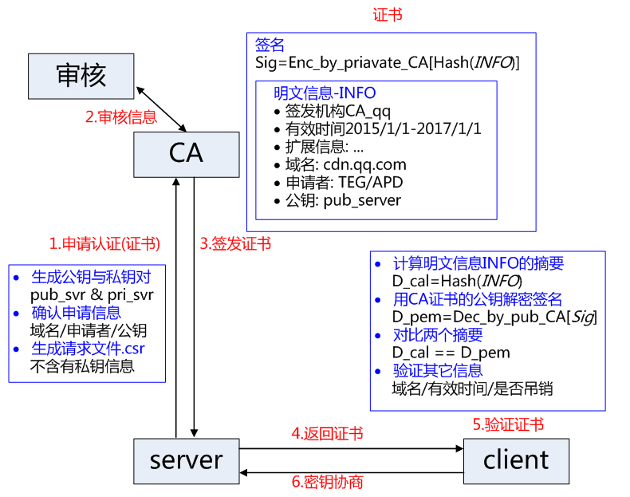

**CA机构 颁发证书的基本原理：**

*   `服务端`生成一对`公钥`、`私钥`。
*   `服务端`将自己的公钥提供给`CA机构`。
*   `CA机构`核实`服务端公钥`拥有者信息：  
    核实申请者提供信息的真实性：如组织是否存在、企业是否合法、是否拥有域名的所有权等。
*   `CA机构`签发证书：  
    CA机构 计算 服务器`公钥摘要信息`，然后利用`CA机构私钥`（CA机构有一对公钥、私钥）加密`摘要信息`。  
    加密后的包含`加密摘要`信息的`服务端公钥`即`CA机构`颁发的`证书`。

**客户端 验证服务端公钥的基本原理为：**

*   `客户端`获取到服务端的`公钥`：  
    Https请求 TLS握手过程中，服务器公钥会下发到请求的客户端。
*   `客户端`用存储在本地的`CA机构的公钥`，对 `服务端公钥`中对应的`摘要信息`进行解密，获取到`服务端公钥`的`摘要信息A`；
*   `客户端`根据对`服务端公钥`进行摘要计算，得到`摘要信息B`；
*   `对比`摘要信息`A与B`，相同则证书验证通过；

3.2.2、证书吊销

`CA机构`能够`签发证书`，同样也存在机制`宣布`以往签发的`证书无效`。若证书的申请主体出现：`私钥丢失`、`申请证书无效`等情况，CA机构需要废弃该证书。

主要存在两类机制：CRL 与 OCSP。

*   CRL（Certificate Revocation List）  
    证书吊销列表：是一个单独的文件，该文件包含了 CA机构 已经吊销的证书序列号与吊销日期；  
    证书中一般会包含一个 URL 地址 `CRL Distribution Point`，通知使用者去哪里下载对应的 CRL 以校验证书是否吊销。  
    该吊销方式的优点是不需要频繁更新，但是不能及时吊销证书，因为 CRL 更新时间一般是几天，这期间可能已经造成了极大损失。
*   OCSP（Online Certificate Status Protocol）  
    证书状态在线查询协议：一个实时查询证书是否吊销的方式。  
    请求者发送证书的信息并请求查询，服务器返回正常、吊销或未知中的任何一个状态。  
    证书中一般也会包含一个 OCSP 的 URL 地址，要求查询服务器具有良好的性能。  
    部分 CA 或大部分的自签 CA (根证书)都是未提供 CRL 或 OCSP 地址的，对于吊销证书会是一件非常麻烦的事情。

3.2.3、证书过期

校验证书的有效期是否已经过期：主要判断证书中`Validity period`字段是否过期。

3.2.4、证书域名

校验证书域名是否一致：`核查` `证书域名`是否与当前的`访问域名` `匹配`。

举例中：  
我们请求的域名 www.baidu.com 是否与`证书文件`中`DNS标签`下所列的`域名`相`匹配`；

**一种错误的写法：**

Android 软件开发中，我们经常会遇到以下代码，用来忽略证书的域名验证，其实这是一种不安全的写法：
    
```java
// 对于自签名证书，用以下代码来忽略证书的域名验证
HostnameVerifier hostnameVerifier = new HostnameVerifier() { 
    @Override public boolean verify(String urlHostName, SSLSession session) {		
    // 忽略证书的域名验证        
    return true;    
    }
};
```
### 四、证书链校验

上一节介绍证书校验场景，适用于`服务器证书`的签发机构就是`Ca机构`。  
实际证书申请中，由于权威的`CA机构`数量不多，若所有的`服务器证书`都向权威CA机构申请，那么CA机构的工作量就会非常大。因此CA机构采取`授权` `二级机构`的方式来管理证书申请，经`授权`的`二级机构`也可以签发`服务器证书`。


#### 4.1、证书链校验

证书签发：

*   `根证书`CA机构 使用自己的`私钥`对`中间证书`进行签名，授权`中间机构`证书；
*   `中间机构`使用自己的`私钥`对`服务器证书`进行签名，从而授权`服务器证书`。

证书校验：

*   `客户端`通过`服务器证书` 中`签发机构信息`，获取到`中间证书公钥`；利用`中间证书公钥`进行`服务器证书`的签名验证。  
    a、中间证书公钥解密 服务器签名，得到证书摘要信息；  
    b、摘要算法计算 服务器证书 摘要信息；  
    c、然后对比两个摘要信息。
*   `客户端`通过`中间证书`中`签发机构信息`，客户端本地查找到`根证书公钥`；利用`根证书公钥`进行`中间证书`的签名验证。

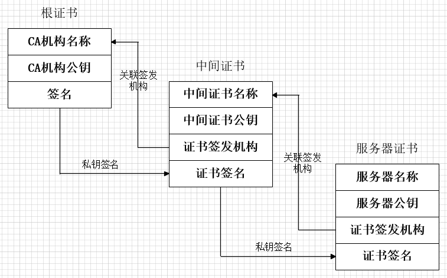

#### 4.2、中间证书怎么获取？

这里可能大家有一个疑问，根证书是内置在终端设备上或浏览器中的，那中间机构证书怎么获取？

这里仍以`百度`的`Tls证书`进行举例，百度`服务器证书` `签发者公钥`（中间机构公钥）通过下图中的URI获取：


#### 五、参考

[TSL标准：](https://tools.ietf.org/html/rfc5246 "TSL标准：")  
[RFC 5246: The Transport Layer Security (TLS) Protocol Version 1.2](https://tools.ietf.org/html/rfc5246 "RFC 5246: The Transport Layer Security (TLS) Protocol Version 1.2")

[X.509标准：](https://datatracker.ietf.org/doc/html/rfc5280 "X.509标准：")  
[RFC 5280 - Internet X.509 Public Key Infrastructure Certificate and Certificate Revocation List (CRL) Profile](https://datatracker.ietf.org/doc/html/rfc5280 "RFC 5280 - Internet X.509 Public Key Infrastructure Certificate and Certificate Revocation List (CRL) Profile")

[SSL/TSL 原理：](https://www.cnblogs.com/chenjingquan/p/10531305.html "SSL/TSL 原理：")  
[SSL/TSL 原理（ 握手原理和传输原理） - 左耳东白水泉 - 博客园](https://www.cnblogs.com/chenjingquan/p/10531305.html "SSL/TSL 原理（ 握手原理和传输原理） - 左耳东白水泉 - 博客园")

[TLS/SSL握手过程：](https://blog.csdn.net/hherima/article/details/52469674 "TLS/SSL握手过程：")  
[HTTPS协议详解(四)：TLS/SSL握手过程_hherima的博客-CSDN博客](https://blog.csdn.net/hherima/article/details/52469674 "HTTPS协议详解(四)：TLS/SSL握手过程_hherima的博客-CSDN博客")