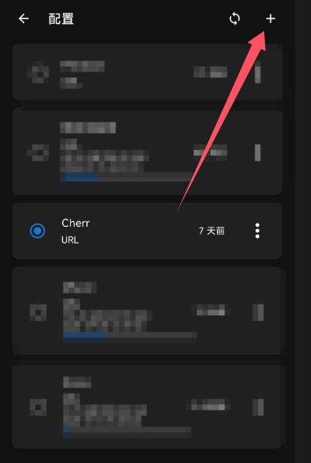

# 机场相关及使用说明

## 我该怎么获得订阅链接/服务器地址？

如果你是从我这里白嫖的机场，那我发给你的那串链接就叫做订阅链接

[免费v2链接](https://gh.api.99988866.xyz/https://raw.githubusercontent.com/aiboboxx/v2rayfree/main/v2)

[免费clash链接](https://gh.api.99988866.xyz/https://raw.githubusercontent.com/aiboboxx/clashfree/main/clash.yml)

如果你想自己租用机场，可以看这里 [机场合集](https://9.234456.xyz/abc.html)

::: tip

**一般来说，我更推荐你使用 Clash 进行网络代理**

:::

## Clash 使用教程

### WINDOWS教程

#### 普通用户

我建议你使用 Clash-verge-rev： https://github.com/clash-verge-rev/clash-verge-rev

如果你网络状况不佳，可以使用这里的蓝奏云链接: https://cherrling.lanzouo.com/iqxNx2hdiysd

下载直接安装，然后在订阅一栏里面填入链接，点击导入

然后在设置页面，打开 `系统代理` ， 如果需要的话也可以打开 `开机自启`

回到代理页面，点击测速按钮，然后选中一个在线的节点，注意右上角选择规则模式

如果你希望全局代理，也可以在右上角的模式选择 `全局` 

#### 进阶版教程

除了 `系统代理` 之外，clash 还支持 `TUN` 模式代理，这种情况下 clash 会在你本地虚拟出一个网卡，
并把本地的（几乎）全部流量"劫持"到这个网卡上，然后再通过 clash 转发到远程服务器。

也就是说，你可以让一些其他应用的流量也被代理

::: tip

***为什么要使用 TUN 模式？***

因为一般的 `系统代理` 模式的原理是修改 windows 的代理设置，由系统去声明一个代理，但也仅仅是声明。

实际上，一个应用的网络是否被代理，完全取决于这个应用自身是否愿意去 `读` 并且 `采用` 系统声明的代理。
由于一般用户使用代理的需求是网页浏览，又因为一般的浏览器(比如 Chrome) 会自己去读取系统代理设置，并且自动调配好应有的代理设置，
所以对于一般用户来说，`系统代理` 就够用了

但是有一些情况，比如你想让一个游戏走代理，或者某些比较简陋的工具，它们并不会去读取系统代理设置，这时候你就需要使用 `TUN` 模式。
`TUN` 模式会将本地全部的流量劫持到 Clash 创建的虚拟网卡上，然后再通过 Clash 转发到远程服务器，这样就可以保证所有的流量都被代理了。
并且一般情况下，如果应用不去主动检测虚拟网卡，它自身应该是感觉不到代理的存在的（只会认为自己就在代理服务器的网络环境中）。

`TUN` 模式就一定好吗？不一定，因为 `TUN` 模式会导致一些应用的网络延迟增加，比如游戏，因为确实需要多走一层应用处理的网络，不过这个延迟一般都是可以忽略不计的。
但是也可能引起另一个问题：

:::

::: danger

**TUN 模式可能会导致一些应用无法正常使用**

尤其是当你使用游戏加速器时，Clash可能和加速器互相抢流量，或者形成嵌套关系，导致无法产生加速效果。

（不过你也可以使用 Netch + clash 实现自建游戏加速器的效果，挖个坑慢慢更新）

:::

你需要先在设置页面安装一个系统服务，这会给你安装一个驱动，然后打开 `TUN` 模式即可。
此时一般不需要打开系统代理，因为所有的流量都会被劫持到虚拟网卡上。

### ANDROID 教程

推荐使用 Clash Meta For Android： https://github.com/MetaCubeX/ClashMetaForAndroid

蓝奏云链接： https://cherrling.lanzouo.com/ihTST2hdn2eh

首先进入设置页面：

然后点击网络，勾选上 `自动路由系统流量`，然后访问控制模式建议选择 `仅允许已选择的应用`，这样你可以设置只有需要的应用才走代理

然后在最下面的配置列表，在里面勾选上你需要走代理的应用。

::: tip

手机上的 Clash 使用 `自动路由系统流量` 模式时，基本等同于 Windows 上的 `TUN` 模式，
系统会自动把（几乎）所有的流量都劫持到 Clash 内，所以这里的应用设置是很重要的。决定了那些应用会走代理。

:::

然后回到主页，选择配置文件

点击右上角的 `+` 号，然后选择 `URL订阅`

填入你的订阅链接，然后点击右上角的 `保存` 图标

回到主页，点击启动，然后进入模式选择节点即可

## v2ray 使用教程

::: tip

以下的 v2ray 教程写于很早之前，可能有些地方已经过时

:::

### WINDOWS教程

首先你得下一个叫v2rayN的东西，

下载地址：https://github.com/2dust/v2rayN/releases

V2RayN 客户端工具下载地址：https://github.com/2dust/v2rayN/releases/download/6.29/v2rayN-32.zip

然后你下载解压之后，复制订阅链接，打开软件

先点击上面的“订阅分组”，再点击“订阅分组设置”

点击添加，然后随便填一个名字，下面填订阅链接

最后回到主界面，点订阅分组，选择更新全部订阅，一个不好使就换另一个。

### 安卓手机教程

首先你得下一个软件

V2RayNG 软件 https://github.com/2dust/v2rayNG/releases/download/1.8.9/v2rayNG_1.8.9.apk

点订阅设置，添加服务器后退回主界面，点右上角三个点-`更新订阅`

>点击图片可放大

